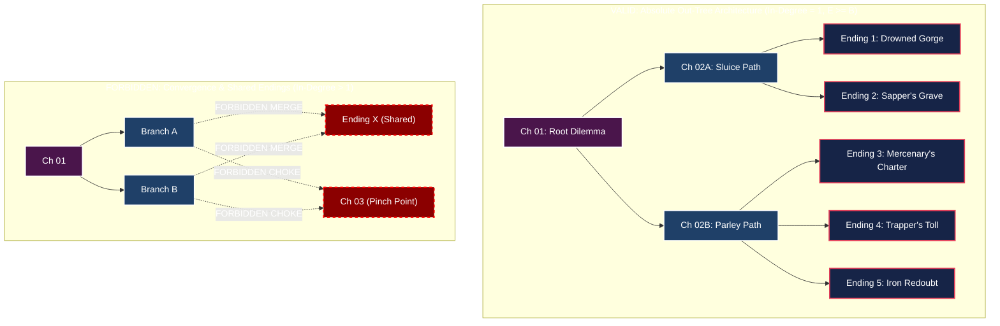

# Interactive Storytelling & Branching Narrative Skill

A specialized, authoritative framework for architecting, designing, and authoring non-linear, choice-driven narratives in StoryCrafter. This skill guides the creation of deep, consequential branching stories where every choice carries meaningful trade-offs, tangible friction, and earned multiple endings.

---

## 1. Core Principles & Philosophy

### 1.1. Anti-Illusionism & Meaningful Agency
In quality interactive storytelling, choices must never be hollow illusions where divergent options immediately funnel into identical text. Every choice must:
1. **Represent a Competing Value or Concrete Tactical Trade-off**:
   - Never offer trivial choices ("Look left" vs "Look right").
   - Choices must force the protagonist to prioritize one vital need over another (e.g. saving structural assets vs saving civilian lives; honoring an oath vs seizing an insurmountable tactical advantage; quick violent gambit vs dangerous diplomatic parley).
2. **Carry Immediate Sensory & Physical Consequences**:
   - The opening beat of the target chapter must immediately acknowledge the chosen action with visceral physical friction, changes in gear/wounds, and shifts in NPC disposition.
3. **Branch Meaningfully**:
   - Each path must reveal unique facets of the world, test different character competencies, and lead toward distinct narrative conclusions.

### 1.2. The Anatomy of Multiple Endings
A story with multiple endings must avoid arbitrary, sudden "you died" traps. Every ending must feel **surprising in the moment, yet inevitable in retrospect**:
- **Thematic Divergence**: Endings should not simply be "Good", "Bad", and "Neutral". Instead, each ending should reflect the logical culmination of the philosophy, alliances, and sacrifices made along that specific branch (e.g., Pyrrhic Military Victory, Commercial Settlement, Covert Sabotage, Catastrophic Sacrifice, Unbroken Last Stand).
- **Poetic Justice & Earned Downfalls**: When antagonists or rival factions meet their end, ensure their reckoning turns their own methods, arrogance, or contracts against them, adhering to the Retribution Principle in `GEMINI.md`.
- **Emotional Closure**: Endings must provide complete narrative and atmospheric resolution, grounding the final beat in concrete in-universe actions (sealing a vault, surveying a flooded valley, signing a parchment) rather than melodramatic mic-drops.

### 1.3. Absolute Tree Architecture & Ending Exclusivity
Every decision branch must culminate in distinct consequences and a dedicated, unshared terminal ending:
- **No Shared Endings**: Multiple branches must never merge into the same ending chapter. An ending belongs exclusively to the unique path that earned it.
- **Zero Convergence**: Once a storyline branches, paths must never rejoin at intermediate chapters or funnel into shared choke points.
- **Mathematical Invariant ($E \ge B$)**: The total number of terminal endings ($E$) must always be greater than or equal to the total number of branches ($B$) at any decision tier. Every branch must lead to at least one dedicated ending.

---

## 2. Technical Authoring Specification in StoryCrafter

The StoryCrafter Web Reader automatically detects interactive stories and parses branching graphs directly from Markdown files. No complex external database or coding is required.

### 2.1. Directory & File Structure
Interactive stories follow the standard StoryCrafter story directory structure:
```
[story_id]/
  ├── chapters/
  │     ├── ch01_root_dilemma.md
  │     ├── ch02a_sluice_path.md
  │     ├── ch02b_parley_path.md
  │     ├── ending01_drowned_gorge.md
  │     ├── ending02_sappers_grave.md
  │     ├── ending03_mercenarys_charter.md
  │     ├── ending04_trappers_toll.md
  │     └── ending05_iron_redoubt.md
  ├── characters/
  ├── world/
  └── outlines/
```

### 2.2. Branching Choice Syntax
At the very end of any chapter that offers a decision to the reader, format choices under an `### Choices` heading using standard markdown link syntax:

```markdown
### Choices
- [Open the low sluice gate to flood the subterranean mine](ch02a_sluice_path.md)
- [Mount the water-gate parapet and receive Baron Kestrel's herald](ch02b_parley_path.md)
```

#### Syntax Rules:
1. Heading must be `### Choices` (case-insensitive).
2. Each choice must be a markdown bullet item with link syntax: `- [Choice Description / Action Text](target_filename.md)`.
3. The target filename must match the exact filename in the `chapters/` directory.
4. The Web Reader strips these raw bullet lines from the main text body and converts them into elegant, book-themed interactive choice cards.

### 2.3. Ending Chapter Syntax
To designate a chapter as a terminal ending, use either a markdown heading or YAML frontmatter:

**Method A: Markdown Heading (Recommended)**
```markdown
# Ending 1: The Drowned Gorge

[Chapter prose...]

### Ending: The Drowned Gorge
```

**Method B: YAML Frontmatter**
```markdown
---
ending: true
ending_title: "The Drowned Gorge"
---
# Chapter Title
[Chapter prose...]
```

When the reader reaches an ending chapter:
- The Web Reader suppresses choice containers.
- An **Ending Banner** is displayed celebrating the discovery (e.g. `Ending 1 of 5 Discovered`).
- The ending is permanently recorded in the reader's discovered achievements.
- Interactive controls (**Restart Story** and **Backtrack to Previous Choice**) are rendered.

---

## 3. Branching Graph Architecture: The Absolute Tree Mandate

To guarantee that player decisions carry genuine, uncompromised weight, all interactive narratives in StoryCrafter must form a **pure directed out-tree (arborescence)** rooted at Chapter 1.

### 3.1. The 3-Tier Tree Architecture (Recommended for 5 to 8 Endings)
```
          [ Ch 01: Root Dilemma ]
                 /        \
       [ Ch 02A ]          [ Ch 02B ]
        /      \            /   |   \
     [End 1]  [End 2]    [End 3] [End 4] [End 5]
```
- **Tier 1 (Root)**: Establishes the high-stakes central crisis, introducing all relevant factions and immediate stakes. Ends in a stark 2-way strategic divergence.
- **Tier 2 (Mid-Game Branches)**: Explores the immediate tactical reality of the chosen vector (e.g., subterranean physical struggle vs diplomatic high-stakes parley). Each introduces a critical second-order complication.
- **Tier 3 (Terminal Endings)**: Final choices trigger decisive climaxes and resolutions. Every path terminates in its own dedicated, unshared ending.

### 3.2. Strict Prohibition of Branch Convergence & Shared Endings
**Zero Convergence Mandate**: All forms of narrative convergence, path merging, or ending recycling are strictly forbidden:
1. **In-Degree Invariant**:
   - The opening chapter has $\text{in-degree} = 0$.
   - **Every non-root chapter (whether intermediate branch or terminal ending) must have $\text{in-degree} = 1$.**
   - Having $\text{in-degree} \ge 2$ (two or more parent chapters pointing to the same child chapter) is an automatic architectural failure.
2. **Strict Prohibition of Shared Endings ("No Funneling")**:
   - Two different branches (e.g. `ch02a` and `ch02b`) must NEVER link to the same ending file (e.g. `ending01.md`).
   - Every single terminal branch must culminate in its own unique, unshared ending chapter.
3. **Strict Prohibition of Intermediate Choke Points**:
   - Authors must never diverge paths only to reconverge them into a shared intermediate chapter. Once paths diverge, they remain completely separate timelines until their respective terminal endings.

### 3.3. Mathematical Branch-to-Ending Invariant ($E \ge B$)
For any valid interactive narrative graph:
- Let $k(u)$ be the out-degree (number of choices) at any decision node $u$. Every decision node must offer $k(u) \ge 2$ choices.
- In a pure directed tree with $L$ decision levels, the total number of terminal ending leaves $E$ is the sum of leaf nodes across all branch lineages:
  $$E = \sum_{\text{branch } b} E_b \quad \text{where } E_b \ge 1 \text{ for every branch } b$$
- Therefore, **Endings $\ge$ Branches ($E \ge B$)** holds across every decision tier of the story. If a story opens with 2 branches, it must possess $\ge 2$ endings; if it branches into 4 paths, it must possess $\ge 4$ endings.



---

## 4. Causal Consistency Across Branches

When authoring multiple narrative branches, the writer must strictly enforce the following continuity vectors:

### 4.1. Epistemic Isolation (Prevent Information Leaks)
- If the protagonist discovers a traitor's identity in Branch A (`ch02a`), they **cannot** possess that knowledge in Branch B (`ch02b`) unless that knowledge was explicitly uncovered along Path B.
- Never let off-screen facts or authorial omniscience bleed between branches.

### 4.2. Resource & Damage Tracking
- **Munitions & Consumables**: If black powder barrels, alchemical reagents, or horse teams are expended in Node A, they cannot magically reappear in downstream nodes.
- **Physical Wounds & Fatigue**: If the protagonist takes shrapnel to the thigh or fractures a forearm in Node A, subsequent scenes on that branch must portray that physical handicap (limping, bracing against stone, dull throbbing pain).
- **NPC Disposition**: Allies who witnessed an act of mercy or betrayal must react accordingly in subsequent scenes on that path.

---

## 5. Adherence to StoryCrafter Workspace Rules (`GEMINI.md`)

All interactive prose, characters, and settings must strictly abide by the rules in `GEMINI.md`:
1. **Forbidden Names & Locations**: Never use banned entities (`Sunken Pass`, `Oakhaven`, `Julian`, `Rian`, `Mia`, `Garrick`, `Bram`, `Varis`, `Silas`, etc.).
2. **Forbidden Beasts & Creatures**: No generic dragons, drakes, monster crawlers, or monster dogs.
3. **Forbidden Tropes**:
   - No opening alley thug muggers to prove physical competence.
   - No subordinate junior clerk or accountant roles.
   - No Northern Barbarian / Frost Horde invasion templates.
   - No Mary Sue infallibility: plans must face resistance, miscalculation, and friction.
4. **Prose Quality**:
   - Strictly ban false dichotomy / negation-contrast tics (`not just A, but B`, `was not A; it was B`).
   - Anchor every scene in at least 3 physical senses beyond sight.
   - Strictly ban the literal word `friction` in story prose (show resistance through mud, rusted gears, seizing winches, sour wine).
   - Natural chapter endings: avoid melodramatic mic-drops.
5. **Tiered Word-Count Standards for Interactive Chapters**:
   Interactive chapters must maintain narrative depth, authentic character agency, and tactical immersion. Never treat branching chapters as rushed outlines or shallow synopses:
   - **Setup / Inciting / Intermediate Chapters** (`ch01`, `ch02`, `ch03`): Minimum **1,500 words** per chapter.
   - **Climax / Major Decision / Terminal Ending Chapters** (`ch04`, `endingXX`): Minimum **2,200 words** per chapter.

---

## 6. Authoring Workflow & Checklist

When commissioned to create an interactive story:

- [ ] **Step 1: Define the Core Dilemma & Setting**:
  - Establish a self-contained, high-tension crisis rooted in independent protagonist agency (e.g. sapper holding a fortress, bailiff arbitrating an impounded vessel, merchant defending a trade lock).
- [ ] **Step 2: Map the Graph & Thematic Endings**:
  - Sketch the Mermaid tree diagram ensuring **in-degree = 1** for all non-root nodes and **$E \ge B$**.
  - Define the thematic title and distinct consequence of each ending.
- [ ] **Step 3: Draft Chapters Sequentially by Branch**:
  - Draft Root Chapter (`ch01`) ($\ge 1,500$ words).
  - Draft intermediate branches ($\ge 1,500$ words each).
  - Draft climax and dedicated terminal endings ($\ge 2,200$ words each).
  - Include `### Choices` and `### Ending: [Title]` tags.
- [ ] **Step 4: End-to-End Continuity Audit**:
  - Walk every path from Root to Ending.
  - Check timeline alignment, resource counts, wounds, and epistemic isolation.
- [ ] **Step 5: Automated Word-Count & Quality Sweep**:
  - Execute direct Python word-count verification across all story chapters:
    ```powershell
    python -c "
    import os, glob
    story_dir = r'[story_id]/chapters'
    for fpath in sorted(glob.glob(f'{story_dir}/*.md')):
        text = open(fpath, encoding='utf-8').read()
        words = len(text.split())
        is_climax = 'ending' in fpath or 'ch04' in fpath
        min_words = 2200 if is_climax else 1500
        status = 'PASS' if words >= min_words else 'FAIL'
        print(f'[{status}] {os.path.basename(fpath)}: {words} words (min {min_words})')
    "
    ```
- [ ] **Step 6: Automated Graph & Tree Audit**:
  - Run the interactive graph auditor on the story directory:
    ```powershell
    python .agents/skills/interactive-storytelling/scripts/verify_tree_graph.py [story_id]
    ```
  - Verify that the audit returns `[PASS]` with 0 violations:
    - In-degree = 1 for all non-root nodes (zero convergence).
    - Zero shared endings across branches.
    - Mathematical invariant satisfied ($E \ge B$).
    - Zero dead ends and zero broken links.
- [ ] **Step 7: Test in StoryCrafter Web Reader**:
  - Verify that the story appears with the interactive badge.
  - Test all choice button transitions and backtrack functionality in both Spread and Scroll mode.
  - Verify that all endings register properly in the Table of Contents tracker.
