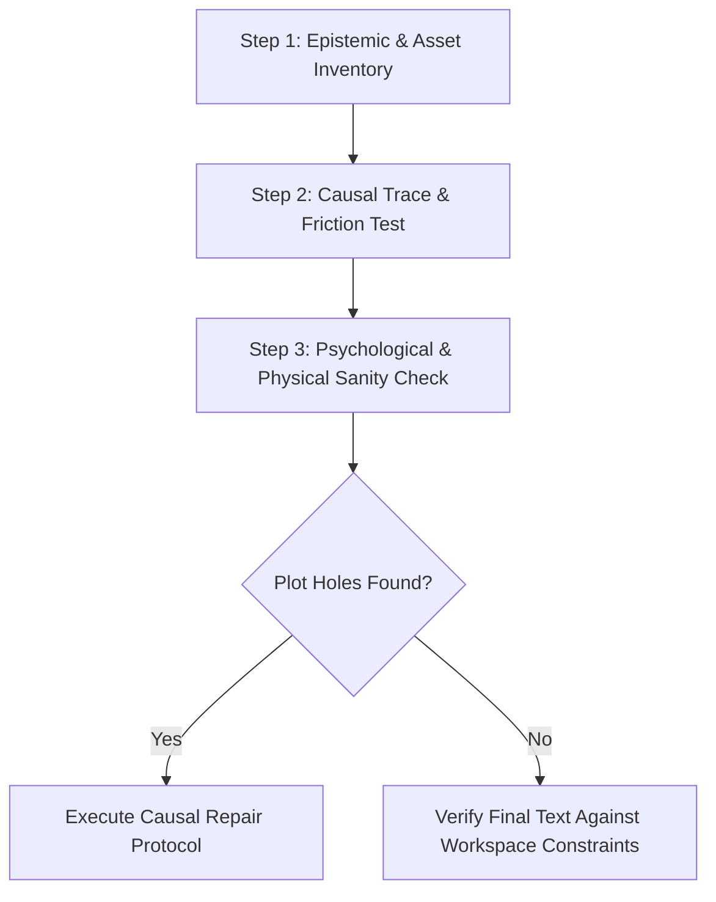

# Narrative Consistency & Plot Hole Auditing Skill

A rigorous, systematic methodology for narrative auditing, plot hole elimination, causal tracking, and psychological coherence across serialized chapters, novels, and multi-arc story projects.

---

## 1. The 8-Point Narrative Integrity Matrix

Every chapter, scene, outline, and lore document must be audited against these eight fundamental vectors of narrative consistency:

| Vector | Core Question | Failure Mode (Plot Hole / Flaw) | Mandated Remediation Strategy |
| :--- | :--- | :--- | :--- |
| **1. Chronology & Timelines** | *Do physical travel times, day/night cycles, recovery periods, and calendar events align logically?* | Characters teleporting leagues overnight; wounds vanishing between consecutive days; seasonal shifts happening inconsistently. | Establish a strict timeline grid with explicit travel speeds, logistical rests, and physical healing rates. |
| **2. Causal Links ("Therefore / But")** | *Does every action result strictly from a preceding consequence or obstacle?* | Events occurring because the plot needs them to ("And then / Suddenly"), rather than following logically from previous actions. | Replace every "And then / Suddenly" with *"Therefore..."* (logical progression) or *"But..."* (logical complication/setback). |
| **3. Information & Epistemology** | *Does the character know only what they could have plausibly observed, heard, or deduced?* | Characters possessing knowledge of secret events, private conversations, or documents without a clear delivery vehicle. | Explicitly track information asymmetry. Every secret must have a designated messenger, overheard whisper, stolen dispatch, or logical deduction chain. |
| **4. Psychological Coherence** | *Do characters act in accordance with their established intellect, trauma, goals, and moral code?* | A ruthless, calculating killer acting inexplicably careless or sparing a key witness by accident; a greedy merchant refusing profit out of the blue. | Ground all character decisions in their established goals and flaws. Sparing a foe or taking a risk must serve a deliberate internal motive (e.g., psychological warfare, calculated leverage). |
| **5. Rules, Physics & Magic Systems** | *Do the world's physical, alchemical, or supernatural systems behave consistently with established costs?* | Magic solving crises without consuming established mana/energy; physical weapons breaking or cutting inconsistently. | Define operational costs, exhaustion limits, and material failure points before life-or-death crises occur. |
| **6. Chekhov's Arsenal & Seeding** | *Are all critical tools, poisons, contracts, allies, or tactics seeded before they resolve a conflict?* | A protagonist pulling an unintroduced weapon, alchemical tincture, legal deed, or secret ally out of thin air at the climax. | Plant every critical plot asset at least 1–2 scenes/chapters prior. If a document is used to break an adversary, dramatize its acquisition in advance. |
| **7. Anti-Deus Ex Machina** | *Do protagonists solve their own dilemmas through agency, sacrifice, and intellect rather than luck?* | Bad luck creating conflict is valid; good luck resolving conflict is strictly forbidden. Miraculous rescues or random divine interventions. | Protagonists must buy their victories with foresight, physical sacrifice, or intellectual leverage. Resolutions must feel earned. |
| **8. Setting Authenticity & Constraints** | *Is the prose free of prohibited tropes, forbidden names, and real-world Earth idioms/eponyms?* | Using banned names (`Bram`, `Julian`, `Silas`), forbidden tropes (opening alley brawls), or Earth eponyms (`Pyrrhic victory`, `Achilles' heel`, `baroque`). | Perform automated and manual sweeps against the project's [GEMINI.md](file:///c:/StoryCrafter/GEMINI.md) constraints and substitute setting-authentic equivalents. |
| **9. Anti-Antithesis & Prose Directness** | *Is the prose free of "not just A, but B", "was not A; it was B", and formulaic negation-contrast tics?* | Using repetitive AI antithesis framing instead of direct, active declarations. | Eliminate all variations of "not just A, but B", "not merely A; it was B", "did not X; they Y". State what the reality *is* immediately with active verbs and concrete sensory details. |
| **10. Anti-Meta & Immersion Integrity** | *Is the prose free of fourth-wall breaks, structural signposts ("Act One concluded", "next arc"), and meta headers?* | Characters or narrator referencing acts, arcs, chapters, or structural story mechanics, breaking reader immersion. | Ensure prose remains 100% inside the diegetic reality. Conclude scenes with organic in-world actions, sensory details, or spoken dialogue. |

---

## 2. Systematic Plot Hole Audit Protocol

When auditing an existing manuscript or drafting new chapters, execute the following three-phase audit:

### Phase 1: Epistemic & Asset Inventory
1. **Asset Origin Tracing**: For every physical item (document, weapon, poison, key, gold purse) used in the chapter, trace backwards to its exact point of origin. If its acquisition was off-screen or unseeded, plant its acquisition in a preceding scene.
2. **Knowledge Ledger**: List every piece of critical intelligence a character acts upon. Confirm how, when, and from whom the character learned it.

### Phase 2: Causal Trace & Friction Test
1. **The Friction Test**: If an obstacle disappears easily, inject realistic friction (social resistance, physical fatigue, cost of goods, suspicious guards).
2. **The "Why Didn't They Just..." Test**: For every adversary action, ask: *What was the most obvious counter-move, and why couldn't they take it?* Ensure adversaries are restricted by plausible hubris, incomplete information, fear, or legal/physical barriers.

### Phase 3: Psychological & Physical Sanity Check
1. **Competence Calibration**: Highly competent characters must not make uncharacteristic amateur mistakes solely to advance the plot. If they make a mistake, it must stem from an established emotional blindspot or calculated gamble.
2. **Consequence Accounting**: Ensure wounds, reputational damage, debt obligations, and resource depletion persist across chapters until properly resolved.

---

## 3. Causal Repair Protocol: Rewriting Strategies

When a plot hole, unseeded turn, or logic contradiction is discovered, use these targeted repair techniques:

### 1. The Living Instrument Technique (Resolving Witness Inconsistencies)
- *Problem*: A ruthless protagonist kills one enemy to prevent witnesses, but leaves another alive purely so the narrative has an eyewitness for a later scene.
- *Repair*: Transform the survival into a **deliberate psychological weapon**. Have the protagonist intentionally spare the survivor with an explicit, terrifying message designed to destabilize the antagonist's composure.

### 2. Upstream Seeding (Resolving Chekhov Violations)
- *Problem*: A character reveals a smoking-gun contract, poison, or secret ally that was never mentioned earlier.
- *Repair*: Insert a seamless transaction, scouting beat, or dialogue hint in the preceding chapter showing the character negotiating for, preparing, or blackmailing to obtain the asset.

### 3. Asymmetric Information Seeding (Resolving Sudden Intelligence Leaks)
- *Problem*: A character knows a rival's secret plan without an explanation.
- *Repair*: Establish an intermediary informant, intercepted dispatch, or commercial ledger anomaly (e.g., unusual grain requisitions revealing troop movements) that allowed the character to deduce the plan logically.

---

## 4. Quality & Verification Checklist

Before publishing or finalizing any chapter:
- [ ] **No Unseeded Deliverables**: Every contract, tool, or weapon introduced in the climax was planted upstream.
- [ ] **Intentional Character Actions**: Sparing foes or taking risks reflects active strategy, not authorial oversight.
- [ ] **Timeline Consistency**: Travel times and recovery windows adhere to realistic pacing.
- [ ] **Zero Forbidden Elements**: No banned names, near-variants (e.g., `Bran` for `Bram`), forbidden tropes, or Earth-derived eponyms/idioms.

### NSFW / Explicit — Explicit, Detailed, Arousing Audit
Apply ONLY to chapters with requested NSFW/erotica content. In NSFW mode, vague fade-to-black or summary sex is a consistency failure — every requested scene must audit as on-page, explicit, and arousing:
- [ ] **Protection-asset count**: Lube/cleanup seeded 1-2 scenes early; used count equals cleanup count (e.g. 4 used = 4 bagged); never conjured mid-climax.
- [ ] **Stamina/timeline grid**: Single-session rounds separated by plausible rest, hydration, food, shower, or position-switch cost; soreness, wetness, and smell persist until cleaned.
- [ ] **Information asymmetry**: Bystander (e.g. returning partner/roommate) learns nothing unseeded; cover story and sensory masking (fan, food smell, straightened sheets) accounted for.
- [ ] **Explicitness mandate**: Act is written on-page moment-to-moment (400+ words per round minimum) with direct anatomical/act language, not euphemism-only or cutaway (`they made love through the night`, `it was a blur`). Flag any off-screen climax or single-paragraph summary as FAIL.
- [ ] **Choreography continuity**: Limb/hand/mouth/leg placement tracked beat-to-beat with no teleporting; clothing-strip order logged (what came off, where it landed, what stayed rucked up); position changes carry physical cost (aching knees, slipped footing, creak, need for lube). Entry/penetration never occurs dry without pain consequence.
- [ ] **Arousal-state continuity**: Hardness, wetness, swelling, slickness, taste/smell (salt, sweat, musk, soap), and sound (kiss-smack, squelch, slap, creak, moan/whimper) escalate without resetting. Orgasm shows involuntary embodiment (contraction, cry, pulse, shake, flooding warmth) — never just announced — and after-effects (stickiness, soreness, trembling, wet sheets) persist until cleaned.
- [ ] **Reader-arousal check**: Scene follows Anticipation → Foreplay + edge/denial → Escalation with pace variation → Staggered climax(es) → Afterglow/cleanup; syntax gets breathless at peak then softens; at least one spoken line of want per 150 words; one exact visceral image beats five vague superlatives. If it reads clinical or repetitive, send back for tease, dirty-talk variation, and sensory rewrite.
- [ ] **Image-to-beat fidelity & asset validation (if image-adapted)**: When adapting from visual reference assets, verify that each image's physical posture, clothing state, facial micro-expressions, and relative angle are faithfully dramatized in chronological sequence without skipping or scrambling the visual choreography. Verify that image tags use valid relative paths (`../assets/<filename>`), point to co-located files in `<story_name>/assets/`, and feature descriptive captions that render correctly in the reader.

### NSFW Multi-Chapter Single-Scene Audit — Extended Arc Extension
Apply ADDITIONALLY when one continuous NSFW encounter proceeds across 2-4 chapters (declared as `NSFW-Arc: ChX-ChY` in `arc_outline.md`). A single scene split across chapters is legitimate sometimes — not default — and must audit as one unbroken chain, not separate hookups stitched together.

- [ ] **Arc declaration present**: Outline tags pattern (`Interrupted & Resumed` / `Continuous Night` / `Slow Tease Chain`), per-chapter beat assignment (which of Anticipation/Foreplay/Escalation/Climax/Afterglow lives where), and running ledger (protection, clothing, mess, timestamps). FAIL any undeclared cross-chapter continuation that resets state.
- [ ] **No reset across break**: Opening state of Ch N+1 equals closing state of Ch N — same hardness/wetness/soreness, same fluids/smell/stickiness, same clothing positions (rucked vs. off vs. on floor), same location mess (damp spot, spilled lube). Flag instant re-hardening without work, vanishing fluids, mysterious redressing, or fresh-sheet amnesia as FAIL.
- [ ] **Hot re-entry, not cold recap**: Continuation chapter opens embodied (1-2 sentence They-Left-Off Anchor through body + immediate touch) with spoken want within 150 words. FAIL dry `Previously...` summaries, or openings that kill arousal to explain plot.
- [ ] **Interruption legitimacy (if Interrupted & Resumed)**: Interrupter (knock, text, call, cramp, breakage) was seeded via Therefore/But, creates cover-story + sensory-masking cost (straighten sheets, fan on, wash hands, hide wrappers), and resume requires re-arousal work. FAIL random unseeded cockblocks used to pad chapters.
- [ ] **Cross-chapter protection & stamina ledger**: Running count holds for whole arc (e.g. 3-pack across Ch03-Ch05: 1+1+0 with wrappers bagged, never duplicated/conjured); rounds separated by plausible bridge (water, snack, shower, piss, position-switch ache); soreness compounds; final chapter alone carries full afterglow/cleanup equal to total mess. Intermediate chapters must use Sustained Heat Bridge (groping wash, grinding cuddle), never resolved sleep/afterglow that falsely ends scene.
- [ ] **Per-installment explicitness**: Each installment with peak act still clears 400+ words on-page per round; bridge-only installments clear 150+ words sustained erotic touch + dirty talk (no sexless filler chapters inside arc). Total beats across arc complete Anticipation → edge/denial → pace-varied Escalation → staggered Climax → Afterglow once at end.
- [ ] **Bystander knowledge across gap**: If interruption/returning character spans the break, audit what they heard/saw/smelled vs. what cover story explains. No unseeded discovery, no forgotten wet sheets/smell that should give them away.
- [ ] **Four-chapter cap**: Single-scene arcs over 4 chapters FAIL for pacing fatigue — require close + new-scene, fresh protection seed, and time/location break.
