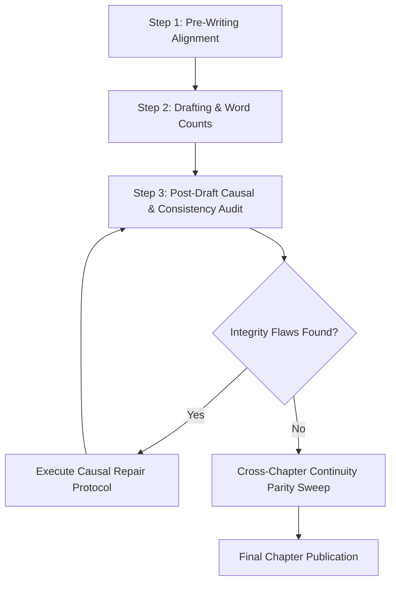

# Story Writing & Narrative Craft Skill

A unified, modular framework for crafting compelling narrative fiction, rich worldbuilding, psychologically grounded characters, ironclad causality, and immersive prose.

---

## 1. Core Constraints & Foundations

All creative drafting and character generation in this workspace must strictly adhere to the single source of truth defined in [GEMINI.md](file:///d:/Documents/story-crafter/GEMINI.md).

### 1.1. Core Craft Prohibitions & Mandated Alternatives

| Category | Policy & Reference | Mandated Creative Strategy |
| :--- | :--- | :--- |
| **Forbidden Locations & Names** | See [GEMINI.md §1](file:///d:/Documents/story-crafter/GEMINI.md) for banned entities (`Sunken Pass`, `Oakhaven`, `Julian`, `Rian`, `Mia`, `Garrick`, `Bram`, `Vaelrian`, `Varis`, `Silas`, etc.) | Construct culturally grounded topiary names and nomenclature rooted in authentic linguistic traditions (Anglo-Saxon, Old Norse, Cornish, Slavic, Latinate, Semitic, Basque) matching the setting's history. Never use thin phonetic reskins. |
| **Forbidden Beasts & Creatures** | See [GEMINI.md §1](file:///d:/Documents/story-crafter/GEMINI.md) (`Dragon`/`Drakes`, `Monster Crawler`, `Monster Dog`, etc.) | Design original fauna with coherent ecology, realistic sensory organs, predatory niches, and environmental adaptation rather than generic fantasy tropes. |
| **Forbidden Narrative Tropes & Trope Recycling** | No `Deus Ex Machina`, no unseeded plot armor, no opening alley mugger encounters, no subordinate clerk positions, no Mary Sue infallibility, no 2D cardboard characters, no shallow/bland evil, no `Northern Invader / Frost Horde / Winter Defile Invasion` tropes, and **no recycling of tropes, crisis templates, or plot dynamics from already existing written stories in the workspace**. See [references/banned-tropes.md](references/banned-tropes.md). | Ground every climax in earned causality. Protagonists rise through independent commercial arbitrage, debt leverage, contract law, or commercial syndication rather than subordinate clerk employment or street mugger beatdowns. Subject schemes to realistic friction, competent opposition, and costly trade-offs. Mandate a prior story audit before outlining new arcs: design original, setting-authentic secondary crises (internal coups, inquisitions, resource embargoes, trade wars, miner rebellions) rather than recycling templates from existing stories (e.g. northern frost invasions in *The Lion's Debt*). |
| **Forbidden Earth Idioms & Eponyms in Fantasy** | See [GEMINI.md §6](file:///d:/Documents/story-crafter/GEMINI.md) and [references/earthly-words.md](references/earthly-words.md) (Strict ban on Earth history, myths, eponyms, architectural styles, real geographies, languages, or religions in secondary worlds) | Translate into setting-authentic equivalents (e.g., *heel-cords*, *ruinous triumph*, *Old Imperial basalt*, *High Imperial script*, *divine mercy of the Light*, *Wester-Reach merino*, *southern blood-stallions*). Full conversion catalog and auditing engine in [references/earthly-words.md](references/earthly-words.md). |
| **Forbidden Earth Labels in Crossover / Native POV** | Strict ban on narrator-level Earth demonyms, dialects, or real-world cultural labels (`Scottish`, `English`, `Dickensian`, etc.) in secondary-world fantasy narration from a native POV. See §6.2 and [references/earthly-words.md §4.3](references/earthly-words.md). | In third-person limited or first-person native fantasy POV, describe transmigrated/crossover travelers' speech and artifacts purely through visceral sensory and acoustic textures (e.g. *a sharp, rolling northern cadence with hard consonants that snap like shears*). While crossover characters may speak Earth names in their own direct dialogue, the fantasy native characters must perceive them with authentic diegetic bewilderment as alien or unknown. |
| **Forbidden Epistemic Plot Holes & Information Leaks** | Strict ban on characters possessing unearned, unbridged knowledge, premature names, secret material composition, or off-screen facts without an on-page diegetic delivery vehicle. See §6.3 and [references/epistemic-tracking.md](references/epistemic-tracking.md). | Treat all unbridged information as critical plot holes. Enforce the Four Pillars: (1) Name/Identity Isolation until diegetically introduced; (2) Material Assay Isolation (crude sensory descriptions by outsiders; no secret alloy names); (3) Off-Screen Medical/Causal Isolation (characters rationalize through their own class/professional biases); (4) Grounded Intelligence Transmission (ban sci-fi hand-waving like 'black-market telegraphs'; route intelligence through artisans, registers, or veteran tactical deductions). |
| **Forbidden Meta-Commentary & Structural Signposts** | See [GEMINI.md §2](file:///d:/Documents/story-crafter/GEMINI.md) (No `"Act One concluded"`, `"Now, we begin the next arc"`, `"The chapter ends now"`, etc.) | Stay 100% within the diegetic narrative reality. Conclude scenes with concrete in-world sensory beats, actions, or spoken orders. Never signpost literary acts, arcs, or chapter mechanics. |
| **Forbidden Meta-Craft & Physics Jargon in Prose** | Strict ban on writing the word `friction` (`frictional`, `frictionless`) or clinical physics jargon (`kinetic force/shock`, `parameters`) in narrative prose, dialogue, or character thought | Embody complications and resistance through visceral in-world realities: mud, seizing axles, cramping muscles, stubborn mules, bad rations, biting wind, concussive blows. Show the drag and strain; never label it with the word "friction". |

### 1.2. High-Impact Prose & Anti-AI Hallmarks

AI-generated fiction frequently falls into formulaic stylistic tics. Actively eliminate these patterns during drafting:

1. **Affirmative Directness (Strict Ban on False Dichotomy / Negation-Contrast Framing)**:
   - *Forbidden Patterns*: `not just A, but B`, `not only A, but B`, `was not A; it was B`, `did not [verb] because A; they [verb] because B`, `no longer A; was B`, `he was not X; he was Y`.
   - *Directive*: Never define what reality *is not* before stating what it *is*. Make direct, active declarations grounded in concrete sensory detail and punchy verbs.
     - *Banned*: "The blast was not a heroic roar; it was the dry clatter of heavy machinery."
     - *Affirmative*: "The blast clattered against the stone like an industrial punch-press."
2. **Sensory Grounding (The 3-Sense Rule)**:
   - Anchor every major scene with at least three distinct senses (smell of damp tallow, taste of metallic well water, texture of salt-crusted woolen cuffs, acoustic resonance, temperature) beyond visual description.
3. **Lean, Muscular Diction ("Never Use a Long Word Where a Short One Will Do")**:
   - Strip stiff, academic, bureaucratic Latinate vocabulary (*withdrawal* -> *retreat/run*, *commence* -> *start*, *utilize* -> *use*, *subsequently* -> *then*, *altercation* -> *fight*, *fabrications* -> *lies*). Match speech registers authentically to character backgrounds (mercenaries speak like killers, nobles speak with cold authority).
4. **Natural Chapter Endings (Strict Ban on Melodramatic One-Liners)**:
   - Ban theatrical mic-drop epigrams, dramatic catchphrases whispered to the wind, or performative closing mottos (`"A Lannister always pays his debts," I said to the wind`).
   - End routine and bridging chapters normally: ground endings in practical character actions, administrative business, logistical orders, or atmospheric observations (closing a ledger, capping an ink-horn, checking an axle pin, pulling on gloves). Reserve thematic closing lines exclusively for pivotal arc climaxes.
5. **Dynamic Action Sequencing**:
   - Avoid simultaneous dual-action overload (`as / while`). Sequence beats cleanly with active verbs and physical consequences.
6. **Eliminate Melodramatic Clichés**:
   - Strip forgotten breathing ("a breath she didn't know she was holding"), melodramatic shivers, eyes flashing with unreadable emotions, and abstract emotion labeling ("cold dread washed over him").
7. **Strict Ban on the Literal Word "Friction" (Dramatize Resistance, Never Label It)**:
   - *Forbidden Patterns*: Never write the word `friction` (or variants `frictional`, `frictionless`) in story prose, dialogue, internal monologue, or narrative descriptions when depicting complications, tactical obstacles, physical strain, logistical delays, or magical effects (e.g., banned: `*Friction,* I reminded myself...`, `feeling the warm friction of my own skin`, `the blessing reduced friction`, `the friction of the march slowed us`).
   - *Why It Is Prohibited*: It is an immersion-shattering AI tic where meta-craft instructions (like "The Law of Plan Friction") leak directly into the character's voice or narrator's vocabulary. It sounds like an engineering manual, physics textbook, or corporate debrief, instantly tearing the reader out of the secondary world.
   - *Mandatory Directive (Show the Drag, Don't Name the Word)*: Embody resistance through visceral, in-world realities: mud sucking at boots, seizing wagon axles, cramping forearms, sour wine, rotted linchpins, suspicious bailiffs, freezing sleet, stubborn pack mules, or bruising concussions. When describing magical speed or evasion, use sensory terms (*buoyed footing*, *skimming above the grit*, *sliding like grease*, *lightened boots*), never clinical physics jargon (*reduced friction*).

---

## 2. Narrative Rhythm & Architecture

### 2.1. The Scene & Sequel Rhythm
Maintain forward momentum and psychological weight by structuring narrative units into alternating **Scenes** and **Sequels**:

1. **Scene (Action & Conflict)**:
   - **Goal**: The POV character enters the scene wanting a clear, concrete objective.
   - **Conflict**: Active, rising opposition (adversary, environment, social pressure).
   - **Disaster / Complication**: Setback or pyrrhic outcome ("Yes, but..." or "No, and furthermore..."). Never an effortless victory walk.
2. **Sequel (Processing & Transition)**:
   - **Reaction**: Visceral, emotional, and physical aftermath of the complication.
   - **Dilemma**: Weighing limited, costly options with no easy solutions.
   - **Decision**: Choosing the least terrible course of action, establishing the goal for the next Scene.

### 2.2. Show vs. Tell Calibration
- **Tell** for narrative compression: travel over uneventful weeks, routine maintenance, or broad political shifts across seasons.
- **Show** for pivotal moments: high-stakes negotiations, tactical showdowns, betrayals, intimate realizations, combat, and moral crossroads.

### 2.3. Measured Plot Twists ("Surprising in the Moment, Inevitable in Retrospect")
1. **The Golden Law**: A twist must be surprising when it lands, but completely inevitable when looking back at upstream clues.
2. **Measured Restraint ("Here and There")**: Reserve major plot twists for pivotal narrative junctions (mid-arc climaxes, act turning points). Avoid constant whiplash reversals that induce twist fatigue and destroy reader investment.
3. **Four Grounded In-World Twist Archetypes**:
   - *The Misread Allegiance*: An ally acts contrary to expectations due to an older, deeper debt or ideological boundary that the protagonist overlooked.
   - *The Inverted Ambush / Counter-Trap*: The protagonist believes they cornered an opponent, only to realize the opponent anticipated the gambit.
   - *The Third-Party Beneficiary*: Defeating a primary rival unintentionally unchains a far more dangerous dormant power.
   - *The Double-Edged Asset*: A captured contract or weapon contains a hidden caveat or systemic vulnerability that reverses leverage.
4. **Fair-Play Seeding Protocol**: Plant clues in plain sight at least 2 to 3 scenes prior with innocent, plausible surface explanations that become undeniable evidence once recontextualized.

### 2.4. Cross-Project Originality & The Prior Story Audit Mandate
1. **Strict Prohibition on Reusing Tropes Across Existing Stories**:
   - Writers must never reuse, clone, or thinly reskin plot tropes, conflict dynamics, crisis templates, military set-pieces, or antagonist downfalls from any existing written story in this workspace.
2. **Why It Is Prohibited**:
   - Each story project must possess its own unique narrative fingerprint and creative DNA. Reusing crisis formulas (e.g., northern barbarian/frost-fiend winter defile invasions, ducal debt audits, identical foreclosure traps) across different stories reduces projects to formulaic reskins and ruins reader immersion.
3. **Mandatory 3-Step Prior Story Audit Protocol**:
   - *Phase 1: Catalog Survey*: Before proposing, outlining, or drafting any new story or narrative arc, examine all existing story projects in the workspace (e.g., *The Lion's Debt*, *The Kingslayer's Reckoning*).
   - *Phase 2: Conflict Disqualification*: Identify and disqualify all major crisis vehicles, military set-pieces, and downfall mechanics used in prior projects (e.g., northern winter horde invasions through mountain defiles belong strictly to *The Lion's Debt*).
   - *Phase 3: Setting-Authentic Conflict Design*: Develop fresh, setting-authentic conflict engines tailored to the specific story's worldbuilding—such as judicial inquests, religious inquisitions, subterranean cataclysms, river canal embargoes, agrarian tax revolts, or guild succession feuds.

---

## 3. Character Architecture, Dimensionality & Antagonists

### 3.1. Unified Character Profile Framework
Every major character must be defined by tension, history, and internal contradictions:

```markdown
### Character Profile Framework
- **Full Name & Epithet**: (Culturally grounded, avoiding forbidden names)
- **Lived Background & Formative Scars**: Formative upbringing, social class, generational debts, and past wounds that actively dictate present choices and negotiation leverage.
- **Concrete External Want vs. Deep Internal Need**:
  - *External Want*: What tangible prize do they demand in this scene/chapter?
  - *Internal Need*: What unvoiced psychological void are they trying to soothe (validation, security, autonomy, absolution)?
- **Core Wound / Misbelief**: What foundational lie do they believe about themselves or the world?
- **Fatal Blind Spot / Genuine Flaw**: A real liability causing costly errors (arrogance, paranoia, tunnel-visioned ruthlessness) — NOT a fake "vanity flaw".
- **Vulnerability & Breaking Point**: What physical, psychological, or logistical pressure pushes them to panic, err, or second-guess themselves?
- **Tactile Tic / Mannerism**: A physical habit under stress (e.g., thumbing a notched knuckle, clearing a gravelly throat, adjusting a brass ring).
- **Dialogue Cadence**: Sentence length, vocabulary register, and topic deflection tactics.
- **Internal Contradiction**: The friction point that prevents flatness (e.g., a compassionate debt-collector; a cowardly duelist with lethal technique; a cynical mercenary who refuses to abandon stray dogs).
```

### 3.2. Anti-Mary Sue & Competence Calibration

1. **The Law of Plan Friction (Clausewitzian Friction)**:
   - No scheme survives contact with reality intact. Weather, supply delays, human miscommunication, contradictory third-party agendas, or clever adversary countermeasures must disrupt the protagonist's design.
   - Protagonist competence shines through **desperate improvisation, resilience, and costly adaptation under pressure**, NOT passive omniscience.
   - **Prose Integrity Warning**: "Plan Friction" is an *authorial architecture principle*, NOT in-world vocabulary for characters! The word "friction" must NEVER appear in dialogue, thoughts, or narrative text. Show the mud, blood, and broken axles; never write the word.
2. **Genuine Consequential Flaws**:
   - Flaws must be genuine liabilities that hurt the protagonist: pride that ignores warnings, greed that overextends lines, or emotional trauma that causes reckless hesitation. Protagonists must occasionally make bad calls and suffer the fallout.
3. **Secondary Character Autonomy (No Sycophant Retinues)**:
   - Supporting characters are never cheerleaders whose sole role is to marvel at the protagonist's genius. Allies have distinct moral lines, personal ambitions, and flaws. They must push back, disagree, and pursue independent self-interest.
4. **The Law of Costly Victories (No Clean Sweeps)**:
   - Every victory extracts a tangible cost (depleted reserves, burnt bridges, scarred bodies, newly ignited complications). Partial victories and pyrrhic trade-offs keep tension alive.
5. **Competence Calibration (Anti-Incompetence & Anti-"Too Dumb to Live")**:
   - Never overcorrect by making the protagonist a bumbling, pathetic butt-monkey. In close-POV storytelling, chronic failure or unforced stupidity destroys reader respect.
   - Keep baseline planning intelligent and rational. Complications must stem from worthy opposition or authentic fog-of-war—**never from the protagonist holding the "idiot ball"**. Protagonists maintain dignity and win through sharp, adaptable resilience.

### 3.3. Dimensional Character Architecture (Anti-Cardboard Mandate)
1. **The Triad of Dimensionality**:
   - *Lived Background*: Present actions are anchored in past survival (an old rout, dispossessed lineage, generational poverty).
   - *Competing Motives*: Characters juggle conflicting goals (e.g., commercial profit vs. aristocratic respectability).
   - *Internal Paradoxes*: Layer contrasting traits (ruthless pragmatism paired with a quiet, unshakeable loyalty).
2. **Autonomous Living Minor NPCs**:
   - Never populate scenes with functional vending machines (the tavern keeper who just pours ale, the guard who silently takes a bribe).
   - Minor characters must display glimpses of their own unwritten lives: an aching back, suspicion born of past grifters, pride in their craft, or an impatient glance toward a cooling kettle. Two sharp details make an NPC a living human being.

### 3.4. Antagonist Architecture: "Fun-to-Hate" Bastards
1. **Beyond Shallow / Bland Evil ("Evil Because He Is Evil")**:
   - Ban cartoonish villains who kick dogs for amusement or laugh maniacally. Adversaries must operate from internally coherent logic—protecting their dynasty, surviving cutthroat competition, enforcing order against chaos, or greed born of past destitution.
2. **The "Fun-to-Hate" Imperative**:
   - Antagonists do not all need to be sympathetic anti-villains; characters can be unapologetic bastards, arrogant tyrants, corrupt magistrates, or petty bullies.
   - **Make Them Compelling to Despise**: Infuse them with sharp charisma, biting wit, flamboyant vanity, intolerable smugness, or audacious cruelty that electrifies the scene. Every time they appear on page, the atmosphere charges with tension and builds delicious reader anticipation for their reckoning.
   - **Genuine Leverage & Competence**: A formidable bastard has institutional rank, legal backing, or tactical cunning. They are not easily brushed aside.
3. **Layered Petty Adversaries**:
   - Ground minor antagonists (corrupt bailiffs, swaggering enforcers) in recognizable human vices: status anxiety, resentment of their betters, or terror of losing their meager authority.

### 3.5. The Cathartic Retribution Principle (Satisfying Payoffs)
1. **Strict Ban on Anticlimactic Retribution**:
   - Never resolve a despised antagonist's arc through random lightning bolts, unearned coincidences, off-screen deaths, or a rushed single-paragraph summary. The reader has earned a front-row seat to their downfall.
2. **Poetic Justice ("Hoisted by Their Own Petard")**:
   - The most satisfying retribution turns the villain's own weapons, arrogance, laws, or cruelty back upon them:
     - The corrupt magistrate who weaponized fine-print clauses is ruined by a hidden clause in his own mortgage.
     - The sadist who humiliated others is publicly exposed and reduced to groveling before those he brutalized.
     - The tyrant who executed subordinates for "disloyalty" is abandoned by his terrified guards at the moment of crisis.
3. **The Three Beats of Cathartic Downfall**:
   - **Beat 1: The Shattering of Certainty**: Dramatize the exact second their smug composure cracks and panic dawns as they realize their leverage is gone.
   - **Beat 2: The Systematic Stripping of Leverage**: Strip their wealth, titles, allies, and defenses step by step on-page.
   - **Beat 3: The Fitting Aftermath**: Ground the final consequence in justice, dignity, and narrative closure.

---

## 4. Narrative Causality, The 13-Point Matrix & Causal Repair

### 4.1. Ironclad Causality Principles
- **The "Therefore / But" Principle**: Link narrative beats with *"therefore..."* (logical consequence) or *"but..."* (logical complication), never "and then... suddenly...".
- **Asymmetry of Luck**: Bad luck may create trouble, but good luck may **never** rescue the protagonist or solve a crisis. Solutions are paid for with character agency, intellect, or sacrifice.
- **Chekhov's Arsenal**: Every critical plot tool, weapon, poison, contract, or ally must be seeded at least 1–2 scenes/chapters prior.

### 4.2. The 13-Point Narrative Integrity Matrix

| Vector | Core Question | Failure Mode (Plot Hole / Flaw) | Mandated Remediation Strategy |
| :--- | :--- | :--- | :--- |
| **1. Chronology & Timelines** | *Do travel times, day/night cycles, recovery periods, and calendar events align logically?* | Characters teleporting leagues overnight; wounds vanishing between consecutive days; seasonal shifts happening inconsistently. | Establish a strict timeline grid with explicit travel speeds, logistical rests, and physical healing rates. |
| **2. Causal Links ("Therefore / But")** | *Does every action result strictly from a preceding consequence or obstacle?* | Events occurring because the plot needs them to ("And then / Suddenly"), rather than following logically from previous actions. | Replace every "And then / Suddenly" with *"Therefore..."* (logical progression) or *"But..."* (logical complication/setback). |
| **3. Information & Epistemic Plot Holes** | *Does the character know strictly what they could have plausibly observed, heard, or deduced?* | **Epistemic Plot Holes**: characters using secret names before introduction; enemies knowing secret alloy compositions (*"meteor shield"*); enemies knowing off-screen medical treatments; ungrounded sci-fi intelligence delivery (*"black-market telegraph"*). | Explicitly track information asymmetry. Enforce the Four Pillars of Epistemic Integrity: Name Isolation, Material Assay Isolation, Off-Screen Causal Isolation, and Grounded Transmission. Never allow characters to leap across gaps in observation. See [references/epistemic-tracking.md](references/epistemic-tracking.md). |
| **4. Psychological Coherence & Depth** | *Do characters act in accordance with their intellect, trauma, goals, and moral code? Are they multi-dimensional?* | Characters acting out-of-character to force a plot turn; characters acting as flat cardboard props without background or contradictions. | Ground decisions in established goals and formative background. Ensure characters display the Triad of Dimensionality. Give minor NPCs authentic texture. |
| **5. Rules, Physics & Systems** | *Do physical, alchemical, or supernatural systems behave consistently with established costs?* | Magic solving crises without consuming energy/materials; physical weapons breaking or cutting inconsistently. | Define operational costs, exhaustion limits, and material failure points before life-or-death crises occur. |
| **6. Chekhov's Arsenal & Seeding** | *Are all critical tools, poisons, contracts, allies, or tactics seeded before they resolve a conflict?* | A protagonist pulling an unintroduced weapon, alchemical tincture, legal deed, or secret ally out of thin air at the climax. | Plant every critical plot asset at least 1–2 scenes/chapters prior. If a document breaks an adversary, dramatize its acquisition in advance. |
| **7. Anti-Deus Ex Machina** | *Do protagonists solve dilemmas through agency, sacrifice, and intellect rather than luck?* | Bad luck creating conflict is valid; good luck resolving conflict is strictly forbidden. Miraculous rescues or random divine interventions. | Protagonists must buy their victories with foresight, physical sacrifice, or intellectual leverage. Resolutions must feel earned. |
| **8. Setting Authenticity & Constraints** | *Is the prose free of prohibited tropes, forbidden names, real-world Earth idioms/eponyms, and recycled story patterns?* | Using banned names (`Bram`, `Julian`, `Silas`), forbidden tropes (opening alley brawls), Earth eponyms (`Pyrrhic victory`), or recycling crisis tropes from existing workspace stories. | Perform automated and manual sweeps against [GEMINI.md](file:///d:/Documents/story-crafter/GEMINI.md) constraints, mandate a prior story audit, and substitute setting-authentic equivalents. |
| **9. Anti-Antithesis & Prose Directness** | *Is the prose free of "not just A, but B", "was not A; it was B", and formulaic negation-contrast tics?* | Using repetitive AI antithesis framing instead of direct, active declarations. | Eliminate all variations of "not just A, but B", "not merely A; it was B", "did not X; they Y". State what the reality *is* immediately with active verbs and concrete sensory details. |
| **10. Anti-Meta & Immersion Integrity** | *Is the prose free of fourth-wall breaks, structural signposts ("Act One concluded", "next arc"), and meta headers?* | Characters or narrator referencing acts, arcs, chapters, or structural story mechanics, breaking reader immersion. | Ensure prose remains 100% inside the diegetic reality. Conclude scenes with organic in-world actions, sensory details, or spoken dialogue. Strictly purge the literal word "friction" and clinical physics/engineering jargon from all story prose. |
| **11. Anti-Mary Sue & "Fun-to-Hate" Foes** | *Does the protagonist face genuine friction without being degraded into an incompetent butt-monkey? Are villains compelling to despise?* | Protagonist acting as an infallible mastermind OR a bumbling fool; villains acting as cartoonish "evil because he is evil" caricatures or dull pushovers. | Subject plans to Clausewitzian friction while preserving protagonist dignity and intellect. Infuse cruel adversaries with charisma, audacity, or intolerable smugness. |
| **12. Plot Twist Fair-Play & Dosing** | *Is the plot twist seeded upstream, inevitable in retrospect, and dosed with restraint ("here and there")?* | Unseeded shock-value reversals ("out of nowhere"); twists that contradict established character traits; or constant chapter-after-chapter reversals that induce fatigue. | Plant clues 2-3 scenes prior with innocent surface explanations; reserve twists for major narrative pivots (mid-arc, act turns); ensure the twist feels earned. |
| **13. Cathartic Retribution & Reckoning** | *Is an antagonist's downfall earned, poetically fitting, and deeply satisfying, or is it rushed, anticlimactic, or an unseeded fluke?* | Despised villains eliminated via random off-screen accidents, sudden unearned strikes, or hasty single-paragraph wrap-ups that cheat the reader of catharsis. | Enforce the Cathartic Retribution Principle: turn the villain's own weapons, arrogance, and cruelty back upon them ("hoisted by their own petard"). Dramatize the three beats of downfall on-page. |

### 4.3. Systematic 3-Phase Audit Protocol
1. **Phase 1: Epistemic & Asset Inventory**:
   - Trace backwards every physical item (document, weapon, poison, key, gold purse) to its point of acquisition.
   - List every piece of critical intelligence a character acts upon. Confirm how, when, and from whom they learned it.
2. **Phase 2: Causal Trace & Friction Test**:
   - *The Friction Test*: If an obstacle disappears easily, inject realistic friction (social resistance, physical fatigue, cost of goods, suspicious guards).
   - *The "Why Didn't They Just..." Test*: For every adversary move, verify why the obvious counter-move was blocked by hubris, incomplete information, fear, or physical barriers.
   - *Effortless Execution Test*: If a plan succeeds without a hitch, fracture it at the halfway mark and force desperate adaptation.
3. **Phase 3: Psychological, Dimensional & Physical Sanity Check**:
   - Verify character choices stem from established motives and flaws.
   - Check consequence accounting: wounds, debt, and depleted assets persist across chapters.
   - Sweep for flat cardboard characters; confirm minor NPCs have a flicker of independent life.
   - Verify cruel antagonists are fun to hate and that villain retribution is poetically earned.

### 4.4. The 7 Causal Repair Techniques
When a narrative flaw is detected, apply these targeted repair strategies:
1. **The Living Instrument Technique (Witness Inconsistencies)**: Transform an inexplicably spared witness into a deliberate psychological weapon sent to deliver a terrifying message that destabilizes the antagonist.
2. **Upstream Seeding (Chekhov Violations)**: Insert a transaction, scouting beat, or dialogue hint in the preceding chapter showing the character preparing or acquiring the critical asset.
3. **Asymmetric Information Seeding (Sudden Intelligence Leaks)**: Establish an intermediary informant, intercepted dispatch, or commercial ledger anomaly that allowed the character to deduce the secret logically.
4. **The Friction Injection Technique (Effortless / Mary Sue Arcs)**: Fracture the scheme at the halfway mark with an unexpected obstacle, forcing the protagonist to improvise under pressure and secure a hard-won, costly victory.
5. **Fair-Play Retro-Seeding (Unearned / Gimmick Twists)**: Plant an innocent-looking anomaly 2-3 scenes prior that has a mundane surface explanation at the time, but becomes the undeniable smoking gun upon the reveal.
6. **The "Fun-to-Hate" Bastard Elevation Technique (Bland Villains)**: Infuse dull adversaries with sharp charisma, audacity, biting wit, or theatrical arrogance. Ground their malice in entitlement, dynastic paranoia, or status anxiety.
7. **The Poetic Retribution Repair Technique (Anticlimactic Downfalls)**: Turn the villain's own weapons, arrogance, contracts, or cruelty against them ("hoisted by their own petard"). Dramatize the shattering of certainty, stripping of leverage, and earned justice on-page.

---

## 5. Dynamic Pacing & Reader Formatting Standards

### 5.1. Dynamic Word Count Thresholds
Every chapter must strictly satisfy word-count thresholds calibrated to its structural role:
- **Bridging / Transition / Setup Chapters**: Minimum **1,500 words** (target 1,550 - 1,800 words).
  - Handles logistical movement, intermediate negotiations, strategic setup, camp life, and character processing between crises.
  - Expand through grounded sensory detail (3+ non-visual senses), operational realism, character voice, and friction.
- **Main Turn-Around / Plot Twist / Climax / Major Confrontation Chapters**: Minimum **2,200 words** (target 2,250 - 2,600 words).
  - Handles major causal turning points, plot reversals, decisive military engagements, high-stakes council showdowns, lethal betrayals, and arc climaxes.
  - Expand through moment-to-moment dramatic tension, tactical choreography, multi-layered dialogue with subtext, psychological reckoning, and the immediate aftermath of the crisis.

### 5.2. Desktop & Web Reader Presentation Standards
All prose is formatted for optimal visual rendering across StoryCrafter Desktop and Web Readers:
1. **Top-Level Chapter Header**: Begin every chapter file with a single top-level markdown title: `# Chapter Title`.
2. **Initial Drop Cap**: The opening paragraph of every chapter automatically formats with a classical gilded drop cap. Ensure the opening word begins with a letter that reads naturally in stylized initial form.
3. **Paragraph Breaks**: Separate all prose paragraphs with standard double newlines (`\n\n`). In spread view, paragraphs automatically receive clean book indentations.
4. **Scene Dividers & Fleurons**: Use `---` or `***` for scene dividers, which render as centered ornamental fleurons (`❦  ❦  ❦`).
5. **In-World Artifacts & Missives**: Use blockquotes (`> `) for letters, decrees, debt ledgers, alchemical formulas, and missives.
6. **Dialogue Formatting**: Enclose spoken dialogue in standard quotation marks with dialogue tags attached to character actions rather than standalone adverbial tags.

---

## 6. Grounded Worldbuilding & Media Lore Standards

### 6.1. Bottom-Up Worldbuilding
Build outward from human survival, trade, and geography:
- **Ecology & Subsistence**: Common diets, water sources, hearth fuels (peat, hardwood, coal, dried dung).
- **Commerce & Currencies**: Goods justifying long-distance routes (salt, tin, silk, preserved fish, tallow); circulating currencies and their real purchasing power.
- **Material Culture**: Architecture matching local geology (rammed earth, slate shingles, fieldstone, timber).
- **Lived Belief**: Historical, lived-in religions complete with superstitions, burial customs, and regional heresies.

### 6.2. Canonical Research for Established Media Elements
When creative writing incorporates, references, adapts, or transmigrates established external media elements (characters, historical figures, mythology, licensed fictional worlds):
1. **Mandatory Proactive Web Research**: Never rely on vague memory or pop-culture memes. Actively research core philosophies, speech registers, physical tics, and canonical history milestones before drafting.
2. **Strict Elimination of Out-of-Character (OOC) Drift**: Preserve their authentic edge, flaws, arrogance, contradictions, and moral ambiguities. Never dilute them into generic archetypes.
3. **Mandatory Post-Draft Canonical Lore Recheck**: After drafting, execute a dedicated secondary audit verifying that internal monologues, dialogue, relationships, and decisions strictly match canonical source material. Use `search_web` to confirm disputed details.
4. **Browser-Aided Research via Edge CDP**: For dynamic, JS-heavy wikis or complex web pages requiring tab interaction or visual inspection, escalate to the companion [`browser-access`](file:///d:/Documents/story-crafter/.agents/skills/browser-access/SKILL.md) skill.
5. **Crossover & Native POV Epistemic Asymmetry Protocol**: When crossing over characters from Earth or sci-fi into a secondary fantasy realm, native fantasy POV narrators must NEVER use real-world Earth demonyms or geography (`Scottish`, `brogue`, `Victorian`, `Dickensian`) as objective descriptors. The native character has no concept of Earth. Render the crossover character's mannerisms and vocal rhythms through concrete acoustic and physical textures (*rolling consonants*, *severe cadence*), while preserving their authentic spoken dialogue and showing the fantasy POV's natural incomprehension.

### 6.3. Rigid Epistemic Tracking & Epistemic Plot Hole Elimination Protocol
Information asymmetry violations, premature name drops, and unearned knowledge leaps are fundamentally **Epistemic Plot Holes**. All drafting and revisions must enforce the Four Pillars of Epistemic Integrity (see [references/epistemic-tracking.md](references/epistemic-tracking.md)):
1. **Name & Identity Isolation**:
   - In third-person limited or first-person POV, narrators and characters must never refer to an unknown person by their true name, title, or secret role until formally introduced on-page in dialogue or read from a document.
   - Describe unknown characters purely through sensory traits (*"the silver-haired stranger"*, *"the traveler in the dark velvet coat"*). The transition to their name occurs only after the on-page introduction (*"I am the Doctor"*).
2. **Material & Asset Assay Isolation**:
   - Adversaries and outsiders cannot know secret alloy compositions, cosmic origins, or technical names (*"meteor iron"*, *"carbonized titanium"*). They must perceive unfamiliar weapons or shields through crude surface traits (*"an unadorned, heavy black iron slab"*, *"scavenged plate without guild crests"*).
3. **Off-Screen Causal & Medical Isolation**:
   - Characters cannot possess psychic awareness of off-screen recoveries or private councils. Adversaries must interpret events through their own class, religious, or tactical biases (e.g., a cleric's superstitious dread of impossible 5th-circle mending miracles; a scout's street-level tavern whispers; an arrogant noble's rationalization of cheap back-alley hedge-doctor potions).
4. **Grounded Intelligence Transmission (Anti-Sci-Fi Hand-Waving)**:
   - In fantasy settings, ban anachronistic sci-fi intelligence delivery crutches (e.g., *"monitored their transactions through the guild's black-market telegraph"*). Intelligence must travel through grounded diegetic channels: warnings from local working-class artisans (armorers, smiths), public or clandestine registry logs, or veteran tactical deductions based on bottleneck terrain.

---

## 7. Explicit Fiction & Extended Arc Standards (On-Request Only)

Use this section ONLY when the user explicitly requests NSFW, erotica, explicit, steamy, or crass sexual content. Otherwise default to non-explicit romance/sensuality.

When activated, every NSFW scene MUST be explicit, detailed, and engineered to arouse the reader. Vague fade-to-black, coy euphemisms, or clinical summaries are consistency failures.

### 7.1. Explicit Language & Arousal Architecture
- **Language Calibration**: Direct anatomical and act language (cock, pussy, clit, nipples, balls, ass, come, suck, fuck, lick, thrust, grind, moan). Mix registers: 70% direct physical + 20% character dirty talk + 10% raw sensory metaphor. Name body parts and actions every 2-3 paragraphs minimum during the act.
- **The 5-Beat Arousal Escalation**:
  1. *Anticipation / Ignition*: Proximity, undressing friction, first touches, scent/taste establishment, verbal want.
  2. *Foreplay Expansion*: Hands, mouths, grinding, breath quickening, swelling, slicking thighs; edge or deny at least once before entry.
  3. *Peak Act / Penetration*: Bursts of thrust-by-thrust rhythm; vary pace (slow deep grind -> fast hard slap -> stuttering loss of control); include position change with physical cost (aching knees, creaking cot, lube/rest need).
  4. *Climax(es)*: Embodied orgasm (involuntary contraction, cry/gasp, pulsing, flooding warmth, shaking legs, whiting vision). Stagger climaxes if multiple.
  5. *Afterglow / Sequel*: Panting cooldown, stickiness, soreness, trembling, banter, cleanup (wipe, wash, drink water), cuddle that locks in the emotional turn. Never cut at climax.
- **Choreography & Senses**: Track limbs, hands, mouths, and clothing state without teleporting. Mandate at least 3 distinct non-visual senses (sweat, musk, soap, slick inner heat, stubble scrape, kiss-smack, squelch, creaking bed) applied directly to the act.

### 7.2. Multi-Chapter Single NSFW Scene Framework
When an outline or user requests an extended encounter spanning 2-4 consecutive chapters:
- **Three Sanctioned Patterns**: (1) *Interrupted & Resumed* (seeded interruption, masking cost, re-arousal work); (2) *Continuous Night / Multi-Round Chain* (Round 1 -> Sustained Heat Bridge with cleanup/hydration -> Round 2/3 with distinct textures); (3) *Slow Tease Chain* (anticipation/undress -> foreplay/edge cliffhanger -> peak act/climax).
- **Continuity Ledger**: Track bodies (hardness/wetness/soreness carry over), fluids & mess (sweat/slick/smell persist), clothing map (exact strip order per chapter), protection assets (running count seeded upstream and accounted for in disposal), and contiguous timestamps.
- **Hot Re-Entry**: Open continuation chapters mid-state (taste still on tongue, thighs still stringing, immediate touch + spoken want within 150 words). Never use cold recap paragraphs (`"Previously..."`).
- **Four-Chapter Ceiling**: Single-scene continuous arcs exceeding 4 chapters fail for pacing fatigue. Close the scene and begin fresh.

### 7.3. Multimodal Pre-Processing & Image Adaptation
- When adapting narrative chapters from reference image sets, compress oversized image payloads locally using Python PIL if total request size risks API limits.
- Map visual poses sequentially to narrative beats with realistic physical transition costs.
- Embed illustrations cleanly using relative paths: `\n\n\n\n`.
- Subagents frequently have safety classifiers that reject explicit NSFW generation; the primary agent must draft explicit scenes directly.

---

## 8. The Complete Writing & Auditing Lifecycle Runbook



### Step 1: Pre-Writing Alignment
- Establish POV, tense, and scene emotional turn.
- **Character Dimensionality & Motive Mapping**: Verify that every character has established background grounding, clear competing motives (external want vs. internal need), and an authentic voice.
- **Antagonist Alignment**: Verify adversarial rationale. If cruel, ensure they are crafted to be **fun to hate** with sharp charisma, audacity, or intolerable smugness. If this scene features their downfall, plan poetic justice ("hoisted by their own petard").
- **Canonical Media Verification**: Proactively research established media characters/factions via web search (or `browser-access` for dynamic wikis) to master canonical speech, mannerisms, and milestones.
- **Foreshadowing & Friction Planning**: Seed required tools/knowledge now; map where the protagonist's initial scheme will encounter Clausewitzian friction.
- **Plot Twist Mapping**: Confirm upstream clues are planted in plain sight with innocent surface explanations; observe the "here and there" restraint standard.

### Step 2: Drafting & Dynamic Word Counts
- **Tiered Word-Count Architecture**:
  - **Setup / Inciting / Intermediate / Bridging Chapters**: Minimum **1,500 words** (verified via strict word count). Used for establishing the operational dilemma, character stakes, logistical positioning, and initial tactical moves.
  - **Main Turn-Around / Climax / Major Confrontation / Ending Chapters**: Minimum **2,200 words** (verified via strict word count). Used for decisive turning points, major payoffs, high-stakes negotiations, complex battles, and terminal resolutions.
- Keep dialogue sharp; characters rarely say exactly what they mean.
- Give minor NPCs a vivid flicker of their own unwritten lives.
- If drafting villain retribution, dramatize the three beats of downfall on-page.
- Preserve protagonist dignity: complications arise from worthy foes or fog-of-war, never unforced stupidity.

### Step 3: Post-Draft Causal, Consistency & Automated Audit
- Execute the 3-phase audit protocol against the 13-Point Narrative Integrity Matrix.
- Check plan friction: if a scheme executed effortlessly, inject Clausewitzian friction.
- Verify that minor NPCs are not cardboard vending machines and adversaries are not bland caricatures.
- If a villain fell, verify the comeuppance was deeply satisfying, earned, and poetic.
- Execute post-draft cross-chapter parity checks: 100% parity for troop counts, escort sizes, coin sums, orders, physical injuries, and weather across chapter boundaries.
- **Automated Verification Command**:
  Always audit newly drafted or modified chapters using direct Python execution (avoiding shell pipeline encoding artifacts on Windows):
  ```powershell
  python -c "
  import os, re
  with open(r'path/to/chapter.md', encoding='utf-8') as f: text = f.read()
  words = len(text.split())
  print('Words:', words)
  print('Frictions:', re.findall(r'friction\w*', text, re.IGNORECASE))
  print('Negations:', re.findall(r'\b(not just|not only|not merely|did not simply|was not [^,.;]+, but|no longer [^,.;]+; (?:he|she|it|they) was|it was not a [^,.;]+; it was|not as [^,.;]+, but as)\b', text, re.IGNORECASE))
  print('Banned:', re.findall(r'\b(Julian|Rian|Mia|Elyria|Garrick|Bram|Vaelrian|Vane|Aethelgard|Harrick|Varis|Corin|Silas|dragon\w*|drake\w*|monster crawler\w*|monster dog\w*)\b', text, re.IGNORECASE))
  "
  ```

---

## 9. Unified Verification Checklist

Before publishing or finalizing any chapter, verify every item:

- [ ] **Zero Forbidden Elements**: No banned names, near-variants, forbidden tropes, or Earth-derived eponyms/idioms (verified against [GEMINI.md](file:///d:/Documents/story-crafter/GEMINI.md)).
- [ ] **Multi-Dimensional Characters (No Cardboard Cut-Outs)**: All characters display lived background, competing desires (want vs. need), and internal contradictions. Minor NPCs possess personal stakes and authentic behavioral texture.
- [ ] **"Fun-to-Hate" Antagonists (No Shallow / Bland Evil)**: Adversaries are not cartoonish "evil because he is evil" caricatures. Cruel or arrogant characters are compellingly fun to hate—infused with sharp presence, audacity, biting wit, or intolerable smugness.
- [ ] **Cathartic & Poetic Retribution**: Any villain comeuppance is earned on-page through poetic justice ("hoisted by their own petard"). The shattering of certainty and stripping of leverage are fully dramatized—never rushed, anticlimactic, or off-screen.
- [ ] **Anti-Mary Sue & Plan Friction Verified**: Schemes do not execute smoothly without opposition or complication. The protagonist faces real resistance, makes imperfect calculations, and adapts under fire.
- [ ] **Competence Calibration & Dignity Preserved**: The protagonist is never degraded into a bumbling butt-monkey or chronic failure. Baseline planning was intelligent, setbacks arose from worthy foes or fog-of-war, and the MC actively adapts to secure a satisfying, dignified win.
- [ ] **Autonomous Allies & Competent Foes**: Opponents fight intelligently; allies challenge the protagonist rather than acting as a sycophantic cheering section.
- [ ] **Tangible Victory Costs**: Victories are not frictionless clean sweeps; the protagonist pays in blood, treasure, reputational fallout, or newly ignited complications.
- [ ] **Plot Twist Fair-Play & Dosing**: Any twist is seeded upstream in plain sight, inevitable in hindsight, and applied with measured restraint ("here and there", not every chapter).
- [ ] **No Unseeded Deliverables (Chekhov's Arsenal)**: Every contract, tool, or weapon introduced in the climax was planted upstream.
- [ ] **Dynamic Chapter Word-Count Thresholds**:
  - Bridging / Transition / Setup Chapters: Minimum **1,500 words** (verified via word count).
  - Main Turn-Around / Climax / Major Confrontation Chapters: Minimum **2,200 words** (verified via word count).
- [ ] **Prose Directness & Lean Diction**: Zero variations of "not just A, but B" or formulaic antithesis tics; prose and dialogue follow Orwell's rule: "Never use a long word where a short one will do."
- [ ] **Natural Chapter Endings (No Melodramatic One-Liners)**: Routine and bridging chapters end normally with grounded, practical character actions, procedural tasks, or natural dialogue. No theatrical mic-drop epigrams whispered to the wind.
- [ ] **Cross-Project Trope Originality**: Verified that the chapter's conflict engine, secondary crisis, military set-pieces, and downfall mechanics do not copy or reskin tropes from other existing stories in the workspace (prior story audit conducted).
- [ ] **Mandatory Post-Draft Canonical Lore Recheck**: If featuring a character or faction from existing media, conduct a secondary post-draft recheck confirming that their internal psychology, referenced history, relationships, and role are strictly canonical to source material.
- [ ] **Crossover Epistemic Asymmetry Verified**: Confirmed zero narrator-level leaks of Earth demonyms or geography (`Scottish`, `brogue`, `English`, etc.) in fantasy POV narration; foreign accents rendered through sensory/acoustic textures; native characters treat spoken Earth terms with authentic diegetic bewilderment.
- [ ] **Zero Epistemic Plot Holes (Information Asymmetry Verified)**: Confirmed zero premature name usage before formal on-page introduction; zero adversary dialogue using secret alloy names (*"meteor iron"*); zero psychic adversary awareness of off-screen healing; zero ungrounded sci-fi intelligence transmission (*"black-market telegraph"*). All intelligence travels via artisans, registries, or tactical deductions.
- [ ] **Post-Draft End-to-End Continuity Parity**: 100% parity across chapter boundaries for quantifiable numbers (troop counts, vanguard sizes, guard escorts, horse numbers, coin sums, wagon loads), action/order handoffs from Chapter N to Chapter N+1, physical injuries/bandages, and environmental states.

### NSFW / Explicit Audit (Only When Activated)
- [ ] **Protection-asset count**: Lube/cleanup seeded 1-2 scenes early; used count equals cleanup count (e.g. 4 used = 4 bagged); never conjured mid-climax.
- [ ] **Stamina & bodily continuity**: Rounds separated by plausible rest, hydration, food, shower, or position-switch cost; soreness, wetness, and smell persist until cleaned.
- [ ] **Explicitness mandate**: Act is written on-page moment-to-moment (400+ words per round minimum) with direct anatomical/act language, not euphemism-only or cutaway.
- [ ] **Choreography continuity**: Limb/hand/mouth/leg placement tracked beat-to-beat with no teleporting; clothing-strip order logged; position changes carry physical cost.
- [ ] **Multi-chapter continuous arc (if declared)**: Opening state of Ch N+1 matches closing state of Ch N (fluids, clothing positions, mess, timestamps); hot re-entry within 150 words; capped at 4 chapters maximum.

---

## 10. Skill References & Companion Guides

- **[Catalog of Forbidden Names, Locations, Creatures & Narrative Tropes](references/banned-tropes.md)**: Authoritative catalog of banned names, locations, creature tropes, narrative clichés, and the cross-project originality mandate prohibiting reuse of arc templates and crisis structures from existing stories.
- **[Earthly Words, Eponyms & Demonyms Reference Guide](references/earthly-words.md)**: Authoritative catalog of forbidden Earth-derived terms, mythological/historical eponyms (`Achilles`, `Pyrrhic`, `Draconian`, `Narcissus`, `Titan`), real-world demonyms/countries (`Spanish`, `French`, `Persian`), architectural styles (`Gothic`, `Romanesque`), and Earth religions/saints (`Christian`, `Saint Jude`), with complete setting-authentic translation lookup tables and automated detection scripts.
- **[Epistemic Tracking & Information Asymmetry Reference Guide](references/epistemic-tracking.md)**: Authoritative catalog defining Epistemic Plot Holes, the Four Pillars of Epistemic Integrity (Name Isolation, Material Assay Isolation, Off-Screen Causal Isolation, Grounded Intelligence Transmission), and systematic remediation protocols for information asymmetry leaks.
