# Story Graph & Narrative Architecture: Forestier After Dark

## 1. High-Concept & Narrative Overview

- **Title**: Forestier After Dark (フォレスティエ・雨宿りの夜)
- **Setting**: The Ancient Hollow Sanctuary inside a primeval elder pine tree deep in the sacred woods.
- **Protagonist**: Yuuki (Princess Knight / Knight of Labyrinth) — First-Person POV.
- **Companions**: Misato (Guild Master & Healer), Hatsune (Psychic Adventurer), Aoi (Elven Archer).
- **Core Narrative Catalyst**:
  - An unseasonal mountain rainstorm drenches the party to the skin during a high-ridge botanical survey.
  - Seeking emergency shelter inside a massive hollow elder pine, the group faces dangerous hypothermia.
  - Stripping off freezing, waterlogged garments to dry by the hearth, the urgent necessity of sharing skin-to-skin body heat under dry blankets thaws shivering limbs and unlocks profound emotional and physical desire.
- **Tier Structure & NSFW Progression**:
  - **Tier 1 (Root, 1 chapter)**: SFW storm escape, shelter arrival, lighting the hearth, shivering vulnerability, and initial branch decision.
  - **Tier 2 (Build-up, 4 chapters)**: Strictly non-explicit emotional and sensual build-up. Shared blankets, chattering teeth easing into soothing warmth, tender confessions, blushing cheeks, gentle touches, and resting against shoulders. Zero explicit sexual acts.
  - **Tier 3 (Foreplay, 9 chapters)**: Full explicit NSFW foreplay begins. Discarding damp underthings, breast worship, mouth-to-skin warming, oral (cunnilingus/blowjob), deep fingering, circulation-warming armpit licking, or rough aggressive petting.
  - **Tier 4 (Terminal Endings, 9 chapters)**: Full explicit penetrative climaxes, creampies, and tender morning afterglows as the rain clears.

---

## 2. Interactive Story Graph (Full Mermaid Flowchart)

```mermaid
flowchart TD
    %% TIER 1 ROOT
    CH01["<b>ch01_the_deluge_in_the_hollow.md</b><br/><i>Tier 1 Root (SFW)</i><br/>Words: ~1,600+"]

    %% TIER 2 BUILD-UP (NON-EXPLICIT)
    CH02A["<b>ch02a_matrons_hearth.md</b><br/><i>Tier 2A: Misato Build-up</i><br/>Words: ~1,600+"]
    CH02B["<b>ch02b_sleepy_embers.md</b><br/><i>Tier 2B: Hatsune Build-up</i><br/>Words: ~1,600+"]
    CH02C["<b>ch02c_the_quiet_alcove.md</b><br/><i>Tier 2C: Aoi Build-up</i><br/>Words: ~1,600+"]
    CH02D["<b>ch02d_gathering_at_the_fire.md</b><br/><i>Tier 2D: Group Build-up</i><br/>Words: ~1,600+"]

    %% TIER 3 FOREPLAY (EXPLICIT)
    CH03A1["<b>ch03a1_mothers_embrace.md</b><br/><i>Tier 3A1: Misato Gentle Foreplay</i><br/>Words: ~1,600+"]
    CH03A2["<b>ch03a2_matrons_fever.md</b><br/><i>Tier 3A2: Misato Rough Foreplay</i><br/>Words: ~1,600+"]
    CH03B1["<b>ch03b1_drowsy_spark.md</b><br/><i>Tier 3B1: Hatsune Drowsy Foreplay</i><br/>Words: ~1,600+"]
    CH03B2["<b>ch03b2_wild_lightning.md</b><br/><i>Tier 3B2: Hatsune Rough Foreplay</i><br/>Words: ~1,600+"]
    CH03C1["<b>ch03c1_first_thaw.md</b><br/><i>Tier 3C1: Aoi Vanilla Foreplay</i><br/>Words: ~1,600+"]
    CH03C2["<b>ch03c2_the_warm_hollow.md</b><br/><i>Tier 3C2: Aoi Armpit Foreplay</i><br/>Words: ~1,600+"]
    CH03C3["<b>ch03c3_the_archers_heat.md</b><br/><i>Tier 3C3: Aoi Rough Foreplay</i><br/>Words: ~1,600+"]
    CH03D1["<b>ch03d1_shared_hearth.md</b><br/><i>Tier 3D1: Group Harmonious Foreplay</i><br/>Words: ~1,600+"]
    CH03D2["<b>ch03d2_primal_canopy.md</b><br/><i>Tier 3D2: Group Primal Foreplay</i><br/>Words: ~1,600+"]

    %% TIER 4 TERMINAL ENDINGS
    E1["<b>ending01_the_guild_mothers_night.md</b><br/><i>Ending 1: Misato Vanilla</i><br/>Words: ~2,300+"]
    E2["<b>ending02_sleeping_in_sparks.md</b><br/><i>Ending 2: Hatsune Vanilla</i><br/>Words: ~2,300+"]
    E3["<b>ending03_first_bloom.md</b><br/><i>Ending 3: Aoi Vanilla</i><br/>Words: ~2,300+"]
    E4["<b>ending04_the_hollow_rite.md</b><br/><i>Ending 4: Aoi Armpit + Normal Sex</i><br/>Words: ~2,300+"]
    E5["<b>ending05_the_storms_hearth.md</b><br/><i>Ending 5: Group Vanilla</i><br/>Words: ~2,300+"]
    E6["<b>ending06_the_matrons_surrender.md</b><br/><i>Ending 6: Misato Deviant (Rough)</i><br/>Words: ~2,300+"]
    E7["<b>ending07_wild_telekinetic_frenzy.md</b><br/><i>Ending 7: Hatsune Deviant (Rough)</i><br/>Words: ~2,300+"]
    E8["<b>ending08_the_archers_surrender.md</b><br/><i>Ending 8: Aoi Deviant (Rough)</i><br/>Words: ~2,300+"]
    E9["<b>ending09_primal_canopy_orgy.md</b><br/><i>Ending 9: Group Deviant (Primal Orgy)</i><br/>Words: ~2,300+"]

    %% TIER 1 -> TIER 2 CHOICES
    CH01 -->|"Warm your hands with Misato by the hearthstone"| CH02A
    CH01 -->|"Sit with Hatsune among the warming cedar boughs"| CH02B
    CH01 -->|"Take a dry blanket to Aoi shivering in the root alcove"| CH02C
    CH01 -->|"Call everyone together around the roaring central fire"| CH02D

    %% TIER 2 -> TIER 3 CHOICES
    CH02A -->|"Surrender to her gentle, motherly care"| CH03A1
    CH02A -->|"Ignite the fierce, untamed hunger behind her calm eyes"| CH03A2

    CH02B -->|"Let her drowse against you with sweet, playful giggles"| CH03B1
    CH02B -->|"Wake the wild, crackling lightning pulsing in her core"| CH03B2

    CH02C -->|"Pull the blanket tight and soothe her trembling chest"| CH03C1
    CH02C -->|"Rub her shivering arms and flanks to thaw her circulation"| CH03C2
    CH02C -->|"Take her hands firmly and pull her into an intense, breathless embrace"| CH03C3

    CH02D -->|"Share a tender, peaceful union under the grand fur quilt"| CH03D1
    CH02D -->|"Cast off all restraint and let primal heat consume the hearth"| CH03D2

    %% TIER 3 -> TIER 4 (ENDINGS)
    CH03A1 --> E1
    CH03A2 --> E6
    CH03B1 --> E2
    CH03B2 --> E7
    CH03C1 --> E3
    CH03C2 --> E4
    CH03C3 --> E8
    CH03D1 --> E5
    CH03D2 --> E9
```

---

## 3. Mathematical Graph Invariants & Technical Auditing

- **Pure Directed Out-Tree**:
  - Root `ch01` has $\text{in-degree} = 0$.
  - All non-root nodes (22 chapters) have $\text{in-degree} = 1$ strictly.
- **Zero Convergence**: No paths merge downstream; zero shared intermediate chapters; zero shared endings.
- **Mathematical Invariant ($E \ge B$)**:
  - Terminal endings $E = 9$.
  - Branch nodes $B = 5$ (`ch01`, `ch02a`, `ch02b`, `ch02c`, `ch02d`).
  - $E \ge B$ holds ($9 \ge 5$).
- **Total Chapters**: 23 (1 Root + 4 Build-up + 9 Foreplay + 9 Terminal Endings).
