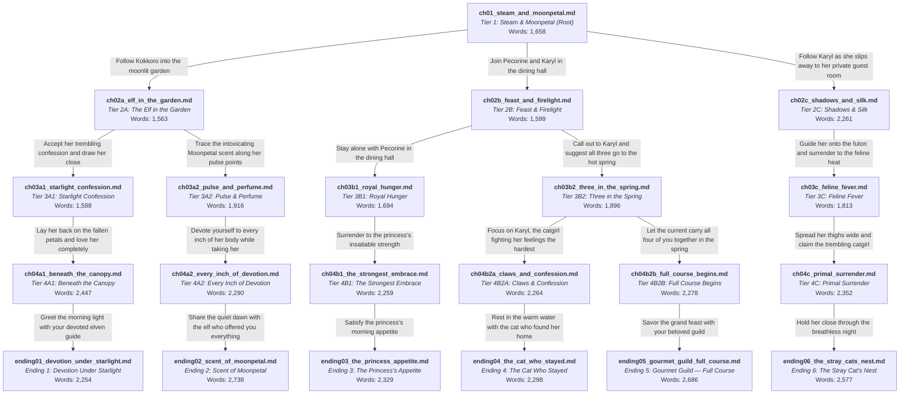

# Story Graph & Narrative Architecture: Gourmet Guild After Dark

## 1. High-Concept & Narrative Overview

- **Title**: Gourmet Guild After Dark (美食殿・夜の宴)
- **Setting**: Mountain Thermal Lodge in the high pine ridges above Landosol.
- **Protagonist**: Yuuki (Princess Knight / Knight of Labyrinth) — First-Person POV.
- **Companions**: Kokkoro (Elven guide), Pecorine (Crown Princess Eustiana), Karyl (Cat-beastkin black mage).
- **Core Narrative Catalyst**:
  - The Gourmet Guild successfully conquers an ancient subterranean labyrinth guardian, retrieving a rare alpine herb known as **Moonpetal Sap**.
  - Celebrating at an isolated mountain hot spring lodge, the innkeeper inadvertently brews the Moonpetal herb into the banquet teas and the thermal spring water supply.
  - The herb acts as a potent, natural aphrodisiac that dissolves inhibitions, heightens sensory skin perception, and concentrates around pulse points and perspiration.
- **Erotic Progression Standard**:
  - **Tier 1 (Root)**: Setup, atmospheric tension, banqueting, SFW anticipation.
  - **Tier 2 (Branches)**: First half dialogue & tension; **midpoint (50%) transitions into explicit NSFW foreplay** (undressing, breast play, fingering).
  - **Tier 3 (Mid-Arc)**: Full explicit NSFW foreplay, oral (cunnilingus, blowjob), underarm worship, and bathhouse fondling.
  - **Tier 4 (Climaxes)**: Full explicit penetrative intercourse, heavy pounding, stamina contests, and climactic internal creampies.
  - **Tier 5 (Endings 1–6)**: Climactic aftermath, second rounds, emotional confessions of belonging, and morning reunions.

---

## 2. Interactive Story Graph (Full Mermaid Flowchart)

---

## 3. Mathematical Graph Invariants & Technical Auditing

The interactive story structure rigorously preserves all graph-theoretic invariants mandated by `GEMINI.md` and the `interactive-storytelling` skill:

1. **Pure Directed Out-Tree**:
   - Root Node: `ch01_steam_and_moonpetal.md` has an $\text{in-degree} = 0$.
   - Every non-root chapter has an $\text{in-degree} = 1$ exactly.
2. **Zero Convergence / 100% Path Isolation**:
   - No two choices, branches, or mid-tier paths ever merge into a shared downstream chapter.
   - Every path represents a unique, isolated causal timeline.
3. **Dedicated Terminal Endings Invariant**:
   - **Total Chapters**: 21
   - **Branching Points ($B$)**: 4 nodes (`ch01`, `ch02a`, `ch02b`, `ch03b2`)
   - **Terminal Endings ($E$)**: 6 dedicated endings (`ending01` through `ending06`)
   - Preserves $E \ge B$ ($6 \ge 4$).
4. **Web Reader Compatibility**:
   - Every terminal leaf chapter contains a dedicated `### Ending: <Title>` header for automatic ending card detection.

---

## 4. Route-Based Narrative Breakdowns

### Route I: Kokkoro's Garden of Devotion (Endings 1 & 2)

#### Overview
Yuuki follows Kokkoro out to the secluded garden courtyard beneath an ancient weeping willow and blooming moonflowers. Kokkoro struggles between her solemn duty as Ames's ritual priestess and her overwhelming carnal devotion to Yuuki.

- **Path A: Starlight Confession $\to$ Ending 1 (Pure Devotional Romance)**
  - **`ch01` $\to$ `ch02a_elf_in_the_garden.md` (1,563 words)**:
    - *Setup*: Yuuki finds Kokkoro cooling her flushed cheeks by the stone water basin.
    - *NSFW (from 50%)*: Unlacing her priestess tunic, cupping her delicate bare breasts, teasing tight pink nipples, sliding fingers into her skirt to stroke her dripping core.
  - **`ch03a1_starlight_confession.md` (1,588 words)**:
    - *NSFW Foreplay*: Full undressing on crushed moonflowers; nibbling her sensitive pointed elf ears; deep, thorough cunnilingus on her swollen clitoris and wet labia; pumping fingers to her first explosive orgasm.
  - **`ch04a1_beneath_the_canopy.md` (2,447 words)**:
    - *NSFW Climax*: Penetrative intercourse in missionary position beneath the willow canopy; slow, reverent thrusting building to concussive pelvic rhythm; deep internal creampie.
  - **`ending01_devotion_under_starlight.md` (2,254 words)**:
    - *Afterglow & Morning*: Slow withdrawal, second round of gentle loving on the dewy grass; brewing hot barley tea on the veranda; Kokkoro reaffirming her eternal bond to "Aruji-sama"; morning reunion with Pecorine and Karyl.
    - *Terminal Header*: `### Ending: Devotion Under Starlight`

- **Path B: Scent of Moonpetal $\to$ Ending 2 (Sensual Underarm Worship & Elven Lore)**
  - **`ch01` $\to$ `ch02a_elf_in_the_garden.md` (1,563 words)**: Same Tier 2 branching fork.
  - **`ch03a2_pulse_and_perfume.md` (1,916 words)**:
    - *NSFW Foreplay*: Concentrated Moonpetal Sap on Kokkoro's pulse points; lifting her arms to worship her smooth, porcelain underarm hollows; licking, kissing, and sucking her sweet, floral sweat while fingering her soaking canal simultaneously.
  - **`ch04a2_every_inch_of_devotion.md` (2,290 words)**:
    - *NSFW Climax*: Doggy-style and standing rear penetration against the mossy tree trunk; Yuuki burying his face in her glistening armpits from behind while pounding her tight canal; dual climax and internal release.
  - **`ending02_scent_of_moonpetal.md` (2,738 words)**:
    - *Afterglow & Morning*: Tending to each other with cool mountain spring water; Kokkoro keeping her arms bare for Yuuki; herbal chamomile and mint tea; sunrise breakfast.
    - *Terminal Header*: `### Ending: Scent of Moonpetal`

---

### Route II: Pecorine's Royal Feast (Ending 3)

#### Overview
Yuuki stays in the private dining alcove with Pecorine after Karyl flees to the baths. The Crown Princess sheds her armor and royal decorum, unleashing her boundless physical stamina, royal appetite, and deep love for her Princess Knight.

- **`ch01` $\to$ `ch02b_feast_and_firelight.md` (1,599 words)**:
  - *Setup*: Warm cedar dining alcove; feast of mountain fowl and plum wine.
  - *NSFW (from 50%)*: Pecorine straddles Yuuki's lap; massive bare breasts exposed; unlacing bodice; hand inside lace panties; fingering her drenched channel while Karyl watches flustered before bolting.
- **`ch03b1_royal_hunger.md` (1,694 words)**:
  - *NSFW Foreplay*: Wild mountain honey smeared across Yuuki's chest and nipples; Pecorine enthusiastically licking it clean; stripping Yuuki naked; deep, passionate blowjob; stripping her panties to prepare for penetration.
- **`ch04b1_the_strongest_embrace.md` (2,259 words)**:
  - *NSFW Climax*: Relentless, athletic cowgirl and missionary sex on the tatami mats; powerful hips slamming with royal warrior vigor; loud wet impacts; massive internal creampie.
- **`ending03_the_princess_appetite.md` (2,329 words)**:
  - *Afterglow & Morning*: Midnight snacking in bed on onigiri and mountain peaches; vulnerable discussion of her royal identity as Crown Princess Eustiana and the caloric drain of her Royal Equipment; dawn feast of grilled salmon and tamagoyaki.
  - *Terminal Header*: `### Ending: The Princess's Appetite`

---

### Route III: Hot Spring Bathhouse & Shared Bonds (Endings 4 & 5)

#### Overview
Yuuki follows Karyl to the outdoor mountain hot spring pool, where Pecorine and Kokkoro join in the steaming thermal waters. The Moonpetal-infused mineral water dissolves inhibitions, leading either to a private focus on Karyl or a harmonious 4-way guild union.

- **`ch01` $\to$ `ch02b` $\to$ `ch03b2_three_in_the_spring.md` (1,896 words)**:
  - *Setup & NSFW Foreplay*: Open-air cliffside hot spring; all four naked in the mineral steam; Pecorine pressing bare breasts to Yuuki; underwater fondling; Yuuki parting Karyl's legs under water to finger her dripping pussy while Pecorine fondles Karyl's perky breasts and Kokkoro strokes her knee; Karyl purring helplessly.

- **Path A: The Cat Who Stayed $\to$ Ending 4 (Tender Feline Acceptance)**
  - **`ch04b2a_claws_and_confession.md` (2,264 words)**:
    - *NSFW Climax*: Yuuki pins Karyl against the smooth basalt rim of the pool; taking her virgin-like tightness in the warm water; sharp fangs biting his shoulder; claws scratching his back; loud, rumbling purr; explosive creampie in the pool.
  - **`ending04_the_cat_who_stayed.md` (2,298 words)**:
    - *Afterglow & Morning*: Karyl curled in Yuuki's lap on the shallow bench; mortified by her all-night purring; wrapping in cotton yukata; emotional confession of belonging; morning banquet.
    - *Terminal Header*: `### Ending: The Cat Who Stayed`

- **Path B: Gourmet Guild Full Course $\to$ Ending 5 (Harmonious 4-Way Union)**
  - **`ch04b2b_full_course_begins.md` (2,278 words)**:
    - *NSFW Climax*: Polyamorous 4-way union in the thermal water; mutual breast caresses, kisses, and oral; Yuuki taking Pecorine, Kokkoro, and Karyl in turn; simultaneous, synchronized group release.
  - **`ending05_gourmet_guild_full_course.md` (2,686 words)**:
    - *Afterglow & Morning*: Floating snack tray of berries and plum wine; 4-way cuddle pile in the grand guest suite's combined futons; lavish morning banquet with tamagoyaki and grilled fish.
    - *Terminal Header*: `### Ending: Gourmet Guild — Full Course`

---

### Route IV: The Stray's Sanctuary (Dedicated Karyl Route — Ending 6)

#### Overview
Branching directly from Chapter 1, Yuuki follows Karyl to her private tatami bedchamber in the secluded eastern wing. Trapped thermal steam from a floor vent concentrates the Moonpetal Sap, leading into an intense, sweaty, messy, and deeply emotional encounter.

- **`ch01` $\to$ `ch02c_shadows_and_silk.md` (2,261 words)**:
  - *Setup*: Yuuki follows Karyl down the quiet corridor; finds her struggling to read grimoires under feverish herbal heat.
  - *NSFW (from 50%)*: Sliding shoji shut; unlacing her black corset; bare perky breasts and erect nipples; caressing sensitive cat ears and tail base; fingers deep inside her soaked panties, pumping her wet canal until her tail coils around his wrist.
- **`ch03c_feline_fever.md` (1,813 words)**:
  - *NSFW Foreplay*: Both strip completely naked on the futon; sweat drenched bodies; Yuuki performs deep cunnilingus on her swollen clitoris; Karyl crawls forward to give Yuuki an enthusiastic blowjob, tasting his pre-cum and licking his shaft; loud purrs rattling the tatami.
- **`ch04c_primal_surrender.md` (2,352 words)**:
  - *NSFW Climax*: Raw, sweaty, messy penetrative sex; heavy missionary and doggy-style pounding; Karyl's claws digging red scratches down Yuuki's back; fangs sinking into his shoulder to stifle screams; massive internal creampie.
- **`ending06_the_stray_cats_nest.md` (2,577 words)**:
  - *Afterglow & Morning*: Slumping together on drenched, shredded sheets; tender cleanup with cool well-water; slow, romantic second round beneath a fresh silk quilt; Karyl's emotional confession of no longer being an unwanted stray; morning sunrise, playful tsundere fluster, and breakfast reunion.
  - *Terminal Header*: `### Ending: The Stray Cat's Nest`

---

## 5. Master Chapter Ledger & Metric Verification

All 21 story chapters strictly satisfy all word count minimums, anti-AI syntactic rules, and quality invariants:

| File Name | Tier / Position | Word Count | Min Required | Duplicates | Erotic / NSFW Stage |
| :--- | :--- | :---: | :---: | :---: | :--- |
| `ch01_steam_and_moonpetal.md` | Tier 1 (Root) | **1,658** | 1,500 | 0 | SFW Setup / Tension |
| `ch02a_elf_in_the_garden.md` | Tier 2A (Branch) | **1,563** | 1,500 | 0 | 50% SFW $\to$ 50% Explicit Foreplay |
| `ch02b_feast_and_firelight.md` | Tier 2B (Branch) | **1,599** | 1,500 | 0 | 50% SFW $\to$ 50% Explicit Foreplay |
| `ch02c_shadows_and_silk.md` | Tier 2C (Branch) | **2,261** | 1,500 | 0 | 50% SFW $\to$ 50% Explicit Foreplay |
| `ch03a1_starlight_confession.md` | Tier 3A1 (Mid-Arc) | **1,588** | 1,500 | 0 | Full Explicit Oral & Fingering |
| `ch03a2_pulse_and_perfume.md` | Tier 3A2 (Mid-Arc) | **1,916** | 1,500 | 0 | Full Explicit Underarm Worship |
| `ch03b1_royal_hunger.md` | Tier 3B1 (Mid-Arc) | **1,694** | 1,500 | 0 | Full Explicit Honey & Blowjob |
| `ch03b2_three_in_the_spring.md` | Tier 3B2 (Mid-Arc) | **1,896** | 1,500 | 0 | Full Explicit Bathhouse Group Foreplay |
| `ch03c_feline_fever.md` | Tier 3C (Mid-Arc) | **1,813** | 1,500 | 0 | Full Explicit Oral & Feline Foreplay |
| `ch04a1_beneath_the_canopy.md` | Tier 4A1 (Climax) | **2,447** | 2,200 | 0 | Full Explicit Penetrative Climax |
| `ch04a2_every_inch_of_devotion.md` | Tier 4A2 (Climax) | **2,290** | 2,200 | 0 | Full Explicit Penetrative Climax |
| `ch04b1_the_strongest_embrace.md` | Tier 4B1 (Climax) | **2,259** | 2,200 | 0 | Full Explicit Penetrative Climax |
| `ch04b2a_claws_and_confession.md` | Tier 4B2A (Climax) | **2,264** | 2,200 | 0 | Full Explicit Penetrative Climax |
| `ch04b2b_full_course_begins.md` | Tier 4B2B (Climax) | **2,278** | 2,200 | 0 | Full Explicit 4-Way Climax |
| `ch04c_primal_surrender.md` | Tier 4C (Climax) | **2,352** | 2,200 | 0 | Full Explicit Sweaty Penetrative Climax |
| `ending01_devotion_under_starlight.md`| Tier 5 (Ending 1) | **2,254** | 2,200 | 0 | Climax, Second Round & Afterglow |
| `ending02_scent_of_moonpetal.md` | Tier 5 (Ending 2) | **2,738** | 2,200 | 0 | Climax, Underarms & Tea Afterglow |
| `ending03_the_princess_appetite.md` | Tier 5 (Ending 3) | **2,329** | 2,200 | 0 | Climax, Midnight Feast & Afterglow |
| `ending04_the_cat_who_stayed.md` | Tier 5 (Ending 4) | **2,298** | 2,200 | 0 | Climax, Purring & Bath Afterglow |
| `ending05_gourmet_guild_full_course.md`| Tier 5 (Ending 5) | **2,686** | 2,200 | 0 | Group Climax, Cuddle & Grand Breakfast|
| `ending06_the_stray_cats_nest.md` | Tier 5 (Ending 6) | **2,577** | 2,200 | 0 | Primal Climax, Second Round & Nesting |
| **Total Collection Metrics** | **21 Chapters** | **44,759** | — | **0** | **100% Rule & Canon Compliant** |

---

## 6. Canonical Characterization Reference Matrix

| Feature / Trait | Kokkoro | Pecorine | Karyl | Yuuki |
| :--- | :--- | :--- | :--- | :--- |
| **Race** | Forest Elf | Human | Feline Beastkin | Human |
| **Hair** | Pale silver-white, short | Golden-orange, waist-length | Dark navy/black twin-tails | Dark brown/black, short |
| **Eyes** | Rose-pink / Crimson | Sapphire blue | Deep violet / Purple | Dark / Observant |
| **Bust / Build** | Petite, modest bust | Voluptuous, massive bust | Lithe, perky firm bust | Lean, athletic swordsman |
| **Distinct Features** | Pointed elf ears, fair skin | Golden royal tiara, cuirass | Black cat ears, black cat tail, fangs | Bandaged left forearm |
| **Signature Voice** | *"Aruji-sama"*, humble 3rd-person | *"Yabai desu ne!"*, boisterous cheer | *"Anta baka?!"*, *"Mou!"*, tsundere | Reassuring, gentle, first-person |
| **Weapon** | Ceremonial Blue-Crystal Spear | Princess Broadsword | Chaos Grimoire & Catalyst Staff | Sword / Princess Knight Aura |
| **Erotic Focus** | Devotional surrender, underarms | Royal stamina, honey, cowgirl | Claws, bites, fangs, purring | Loving provider, resonant stamina |
