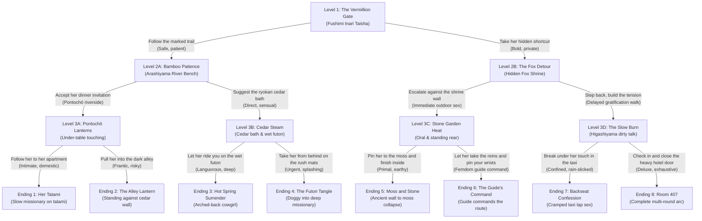

# The Vermillion Route (朱の道)

An explicit interactive romance and erotica novel set in contemporary Kyoto, featuring an original licensed tour guide, **Chinatsu Ibuki (伊吹 千夏)**.

---

## Story Overview
- **Title**: The Vermillion Route (朱の道)
- **Genre**: Interactive Fiction, NSFW / Contemporary Erotica, Romance
- **Format**: 4 Levels, Balanced Binary Tree, 8 Distinct Terminal Endings
- **Total Word Count**: ~27,123 words across 15 chapters
- **POV**: First-person (unnamed reader-insert)
- **Tense**: Past tense
- **Setting**: Kyoto, Japan (Fushimi Inari Taisha, Arashiyama Bamboo Grove, Pontochō, Ryokan Suimei-an, Higashiyama, Kennin-ji)

---

## Interactive Branching Architecture

---

## Directory Structure
- `chapters/`: 15 chapter markdown files (7 branching nodes + 8 terminal endings).
- `characters/`: Complete profile for Chinatsu Ibuki (`chinatsu_ibuki.md`).
- `world/`: Authentic Kyoto locations and architectural/sensory anchors (`kyoto_locations.md`).
- `outlines/`: Arc design, branching logic, and clothing/state tracking ledger (`arc_outline.md`).
