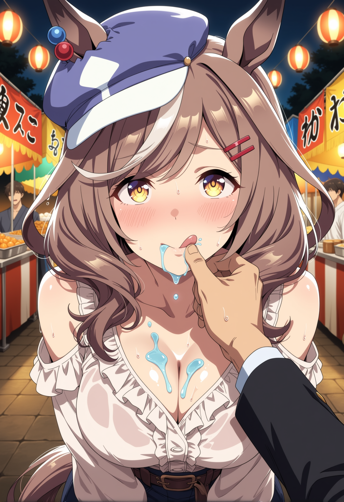
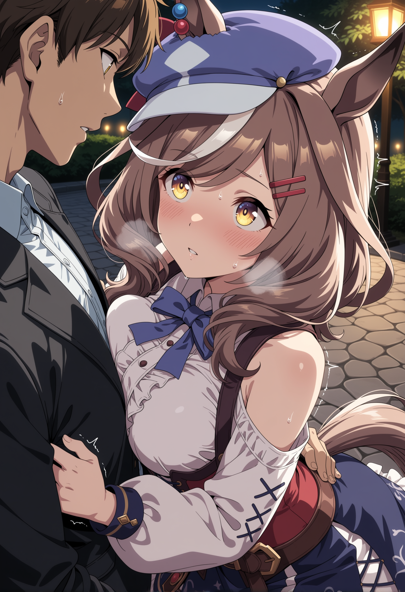

# Lanterns and Laughter

The taiko hits your chest before you hear it. A low, resonant thump that rolls through the crowd like a second heartbeat, and you feel it in the backs of your teeth, in the soles of your sandals against the packed earth. The shrine grounds are thick with bodies tonight — Obon brings everyone out, Tracen's students and staff and half the neighboring town spilling between food stalls draped in red-and-white bunting, the air dense with yakisoba smoke and the caramel-sweet char of grilled dango.

Machitan is three paces ahead of you, weaving through the crowd with the kind of cheerful determination she brings to everything. Her yukata is white cotton printed with blue morning glories, the obi sash cinched neatly — someone on Team Canopus must have tied it for her, because there's no way she managed that crisp a bow on her own. Her chestnut hair hangs loose tonight, no beret, and the white forelock streak catches every paper lantern they pass under, flashing pale gold. Her horse ears swivel constantly, drawn to every new sound — a child's shriek, a vendor's bark, the off-key singing from the beer garden. The red and blue beads on her right ear glint like tiny signal lamps.

"Trainer! Over here — they have ring toss!"

She's already at the booth before you catch up, pressing coins into the vendor's hand with both palms like she's making an offering. She gets five rings. The first one ricochets off the neck of a bottle and hits a stuffed cat. The second skips across three bottle tops without hooking a single one. The third goes sideways.

"That one doesn't count," she announces, adjusting her stance like a batter digging into the box. "The wind caught it."

There is no wind. The summer air sits on the festival like a damp wool blanket, thick with humidity and fry oil and the green smell of the cedar grove flanking the shrine steps.

The fourth ring clips a bottle, wobbles, and falls flat. The fifth doesn't even make it to the target zone.

The vendor gives her a consolation prize anyway — a tiny paper fan with a goldfish printed on it. She accepts it like a trophy, beaming so hard her ears perk straight up, and tucks it into her obi.

"I'm better when the stakes are higher," she tells you, completely serious.

You buy kakigori from the next stall. Blue raspberry for her, lemon for you. The shaved ice is half-melted before you get it, the syrup running in vivid rivulets down the paper cone. She takes a bite too big and winces — cold headache — then laughs through it, pressing her palm to her forehead. Blue syrup drips onto the front of her yukata.

"Oh no. Oh — it looks like I'm bleeding some kind of alien—" She dabs at it with a napkin, smearing it wider. "Well. That's there now."

You eat your lemon ice walking through the crowd, shoulder to shoulder because the press of festival-goers makes single-file impossible. Her bare forearm brushes yours. Warm skin, faintly damp from the humidity. She smells like soap — something plain, unscented — layered under the charcoal and sugar of the festival air. Every few steps her tail swishes behind her, tickling the back of your hand.

She chatters. About training schedules, about how Kitasan Black won another race and it was "incredible, really, she's on a completely different level," about how she messed up her interval workout yesterday by tripping on the track's inner line. She doesn't stop talking, but she keeps glancing at you between sentences, quick sidelong looks from those amber-yellow eyes, as if checking whether you're still listening. You are. You always are.

The crowd surges around a bon-odori circle, dancers in matching happi coats moving through practiced steps. You get pushed closer. Her hip bumps yours. She steadies herself with a hand on your forearm and doesn't take it away.

Then her sandal catches a flagstone edge.

She pitches forward — and you've been ready for this since you met her, because Matikanetannhauser trips on flat surfaces the way other people blink. Your hand catches her waist, the other gripping her upper arm. The momentum swings her into you, close, and suddenly her face is right there. Centimeters. You can see the darker purple rim at the top of her irises, the individual lashes casting tiny shadows. Lantern light paints one side of her face warm orange. Her ears flatten straight back against her hair.

She doesn't pull away.

The taiko drums pound. The crowd flows around you like water around stones. Her fingers are still curled into the front of your yukata from when she grabbed for balance.

"I'm—" Her voice comes out smaller than usual. "I'm really clumsy, huh."

She's not talking about the flagstone. Her ears are still flat. Her tail has gone perfectly still behind her.

You don't let go of her waist.

She looks away first. Takes a breath. Then: "It's kind of... loud here. Do you want to walk? Up toward the shrine? It's quieter."

The path up the hillside narrows past the last food stalls, climbing through cedar trees hung with lanterns that get sparser the higher you go. The taiko fades from chest-thumping to a gentle pulse, then just a murmur beneath the cicadas. Fireflies blink in the underbrush — erratic, yellow-green sparks drifting between fern fronds and moss-covered stone markers.

She walks beside you, close enough that your knuckles brush. The yukata whispers against her legs with each step. She's gone quiet, which is unusual for her. Her ears keep twitching — orienting toward you, then forward, then you again.

"Trainer," she says eventually, her voice careful in a way it never is. "Do you ever think... that everyone at Tracen is kind of special? Like, really genuinely unique and talented and — I don't know. Dazzling?" She fidgets with a loose strand of hair. "And that maybe there's one person who's just... normal. Who works hard but is just normal."

"You're not normal."

"I literally tripped on nothing five minutes ago."

"You got back up in half a second. You always get back up." You mean it. The words come out unplanned, blunt, and you see them land — her step falters, not a trip this time, just a small hitch in her stride. "I've watched you lose races, twist ankles, bonk your head on the starting gate — and every single time, you're back on the track the next morning. That's not normal. That's rare."

Her ears twitch. She doesn't say anything for several steps. The last paper lantern on the path hangs from a low cedar branch just where the maintained grounds give way to wild underbrush and deeper trees. Its candle gutters in a draft, throwing wobbling shadows across her face.

She turns to you.

"Trainer, I—"

You kiss her. Or she rises onto her toes and closes the gap — it happens in the same breath, mutual, and the distinction doesn't matter because her mouth is warm and tastes like blue raspberry and summer air, and her fingers fist the front of your yukata at the collar and pull, and the paper lantern flickers, and the cicadas are deafening, and her tail goes stiff behind her like a rod.

The kiss deepens. Her mouth opens against yours. Your hand slides from her waist to the small of her back, pulling her flush. The other hand finds the nape of her neck, fingers threading into her loose hair, and she makes a small, desperate sound into your mouth — half gasp, half whimper.

She pulls back just far enough to breathe. Her eyes are dark, pupils blown wide against amber. Her ears are flat, trembling.

Then she takes your hand and walks backward off the path, into the gap between two old cedars, pulling you with her. Into the dark, into the trees, her mouth finding yours again, hot and open and tasting of sugar and wanting.

