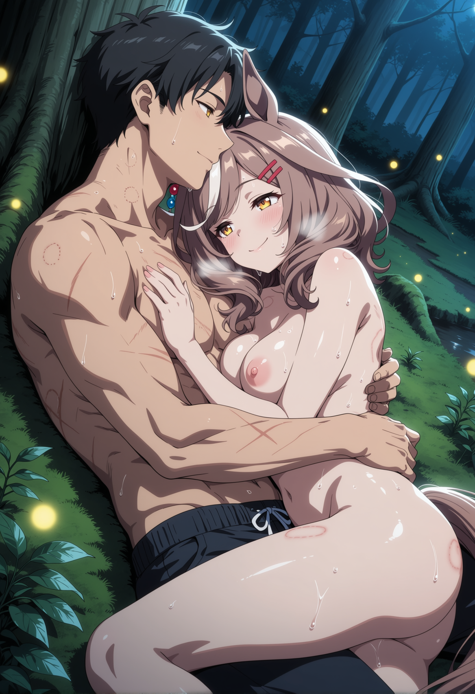
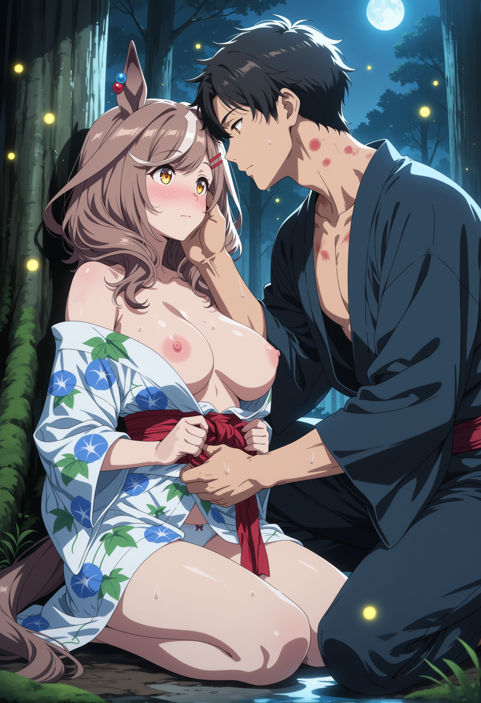
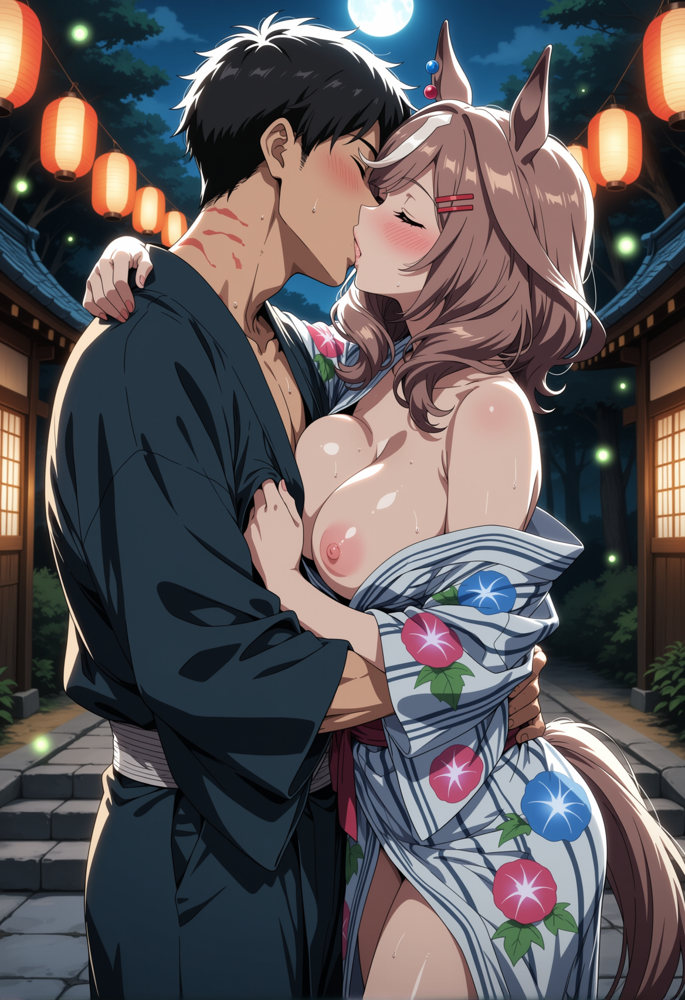

# Afterglow Between the Lanterns

You don't know how long you lie there.

Long enough for the sweat to cool and the night air to raise goosebumps along your arms. Long enough for her shaking to subside into occasional tremors — a twitch of her thigh, a flutter of her stomach muscles, aftershocks diminishing like ripples in still water. Her ear twitches against your chest in lazy intervals, the beads tapping your collarbone with each small movement. Her tail rests across your thigh, motionless except for the faintest metronome sway at the tip.

The stream sounds louder now that everything else has gone quiet. No taiko drums. No festival chatter drifting through the trees. Even the cicadas have thinned to a sparse, intermittent chirr. The Obon festival is over. Just the water, and the two of you breathing.

You become aware of your body in stages. The scratches on your back — a lattice of stinging welts from her nails, bark scrapes from the cedar layered on top, all of it throbbing in a dull, persistent heat. Your knees, sore from the ground. Your arms, heavy from holding her weight. The bite mark on your shoulder is a deep, localized ache, crusted at the edges. You feel wrecked. You feel good.

She stirs first. Lifts her head from your chest — slowly, like the effort costs something. Her hair is a disaster: chestnut strands tangled and matted with sweat, the white forelock plastered in a damp curl across her forehead. Moss fragments cling to her shoulder. A constellation of red marks — bite bruises, pressure points, the beginning of hickeys — trails down her neck and across her collarbones.

"We should..." She gestures vaguely toward the stream. Her voice is still hoarse. "Clean up. We look like we lost a fight."

"We kind of did."

She snorts. Then winces — sore abs. "Ow. Don't make me laugh."

Getting to the stream is an exercise in mutual support. Her legs genuinely don't work properly — the muscles tremble when she puts weight on them, and the first step produces a wobble so dramatic she grabs your arm with both hands. You're not much better. Your thighs are leaden, your lower back a knot of overworked muscle. You lean on each other, stumbling the few meters to the water's edge like two people navigating a moving deck.

The stream is cold. She knew that already, but it still shocks a yelp out of her when she steps in — ears shooting straight up, tail puffing, her whole body going rigid for one comic second before she forces herself deeper. The water barely reaches her calves but the chill is bracing after the heat of everything that came before.

You kneel beside her. Cup water in your palms and pour it over her shoulders, her back. She hisses when it hits the bark scrapes — raw patches where the cedar stripped her skin, angry and pink in the moonlight. You wash them gently. Trace the edges with careful fingers.

"Those are going to sting in the shower tomorrow," you tell her.

"Worth it." She says it immediately, without thinking, then goes pink. Her ears fold halfway down — the shy angle, not the overwhelmed one. Different geometry entirely.

You wash each other. It's tender and practical and nothing like sex — careful hands avoiding the worst of the scrapes, sluicing away dried sweat and the sticky residue of two rounds. She cups water between her thighs, cleaning herself with quick, efficient motions, grimacing slightly at the sensitivity. The intimacy of it is quieter than anything that came before, but heavier somehow. You're seeing her in the aftermath, the unvarnished reality of what you did together, and neither of you is looking away.

She stands in the stream, dripping, arms crossed over her chest against the cold. Moonlight paints her in silver and deep shadow. The water runs down her legs in thin rivulets. She's looking at you with an expression you can't quite read — soft, a little bewildered, deeply warm.

"Stop staring," she mumbles. But she doesn't turn away.

Back in the clearing, the hunt for scattered clothing in near-darkness becomes its own small comedy. Her bra is tangled in a fern. Your underwear ended up three meters from where you remember removing it, hooked on a root. She steps on a pinecone barefoot and hops on one leg, swearing under her breath — the canonical clumsiness reasserting itself like a physical law.

"Of course," she mutters, rubbing her foot. "Of *course* that happens."

She pulls on her panties, then her yukata, wrestling the damp cotton over damp skin. The morning-glory print is smudged with moss stains and crumpled beyond recognition. She holds up the obi sash, looks at it, looks at you.

"I can't tie this. My hands are shaking." She holds them up as evidence. They are, in fact, trembling. "I could barely tie it when my hands *weren't* shaking."

You kneel in front of her. Take the sash. Wrap it around her waist — your knuckles brush her hip bones, still warm through the cotton. You tie the obi in a simple knot. Not the elaborate bow her teammate managed earlier; just functional, enough to hold the yukata closed. Your hands rest on her waist when you're done. You look up at her.

She touches your face. Fingertips on your cheek, thumb at the corner of your mouth. Her ears twitch.

"Trainer." Her voice is small, careful, the way it gets when she's about to say something that costs her. "I didn't... plan that. Any of it. The — the rough part." She fidgets with a strand of loose hair. "I didn't know I was like that. I don't know where it came from."

"I liked it."

She goes red. Not the flushed, overheated pink of sex — a new blush, climbing from her chest to her ears in a wave. Her ear tips turn scarlet. Her tail does a quick, nervous flick behind her.

"You — really?"

"Really."

She exhales. A shaky, relieved breath that takes something heavy with it. Her ears perk back up — not all the way, but enough. A small, tentative smile.

"Okay. Good. That's — good." She nods, mostly to herself. "Okay."

You get dressed. Your yukata has survived better than hers — fewer stains, only one small tear at the hem where her foot caught it. The fabric feels rough against the welts on your back, every brush of cotton a reminder.

The walk back follows the shrine path downhill. The paper lanterns are burned out — just dark cylinders of oiled paper dangling from their posts, trailing thin threads of smoke. The air still carries the ghost of festival food: cold grease, extinguished charcoal, the bitter sweetness of spent sparklers. The stone path is littered with the debris of celebration — crumpled napkins, a child's lost sandal, a broken glow stick still faintly green.

She walks beside you. Close. Her shoulder bumps your arm with every other step. She doesn't fill the silence for once — no chatter about training or race results or how she messed up her interval workout. The quiet is comfortable. Full.

At the bottom of the path, where the cedars thin and the shrine grounds open into the main approach road, she slips her hand into yours. Her fingers are cool from the stream. She laces them through, firm, deliberate — the grip of someone who's made a decision.

Then her sandal catches a tree root.

She lurches forward, and your hand is already on her waist, your other arm catching her elbow, steadying her the same way you did at the festival three hours and a lifetime ago. She hangs in your grip for a beat, looking up at you. Same amber eyes. Same lantern glow — except it's moonlight now, and the expression behind those eyes is different. Knowing. Warm. A little raw, like a new bruise that hasn't decided yet whether to ache or sing.

She laughs. Quiet. Just for you.

"Some things never change, huh?"

You kiss her. Soft. She tastes like stream water and cold night air — nothing sweet left, nothing artificial. Just her. Her ears are up, perked, happy. The beads catch the moonlight one last time.

You walk back onto the empty festival grounds. The stalls are shuttered, tarps pulled over, the strings of lanterns dark overhead. A cleanup crew works in the distance, folding tables and stacking chairs. Nobody looks at you. Two people in rumpled yukata walking home from a festival — nothing to see.

Her hand stays in yours. She bumps your shoulder again.

"Next time," she says, and there's that grin — the bright, irrepressible one, the one that survives every stumble and every loss and every nosebleed, the one that has never once wavered, "maybe somewhere with a real bed?"

Her tail swishes. Once. Lazy, content, certain.

You squeeze her hand and walk her home.
