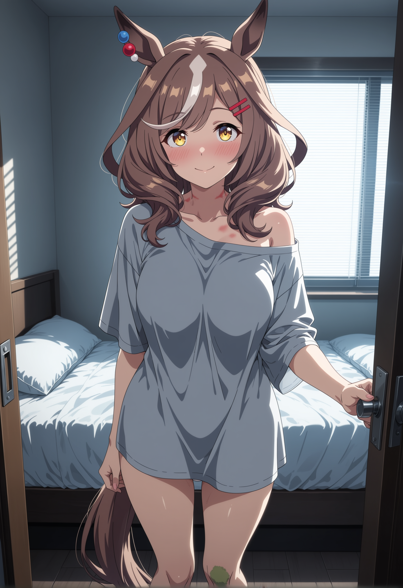
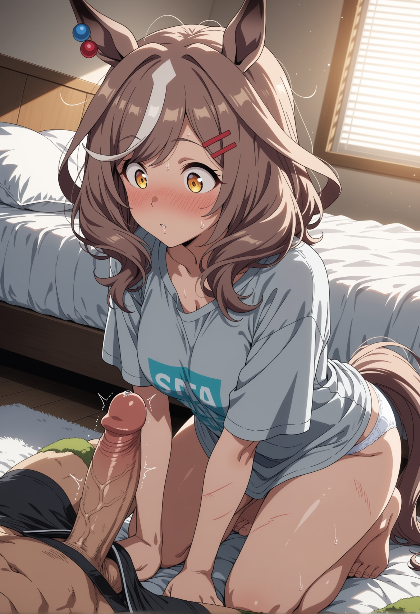
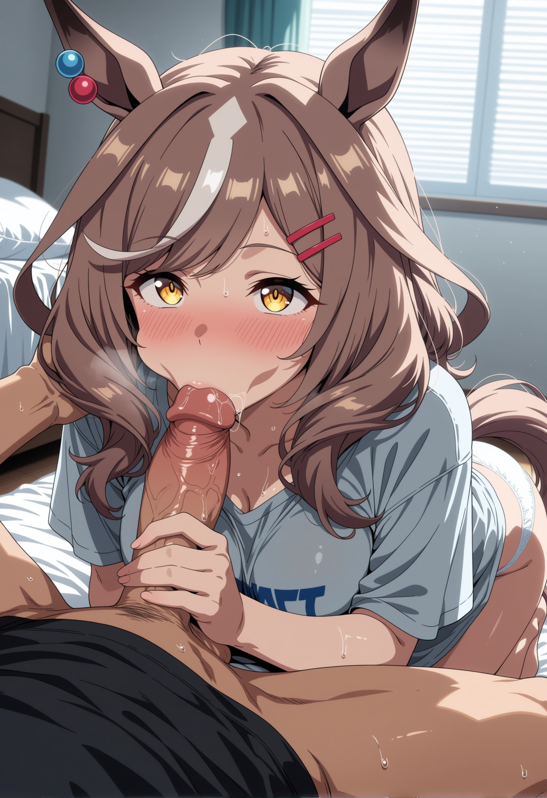
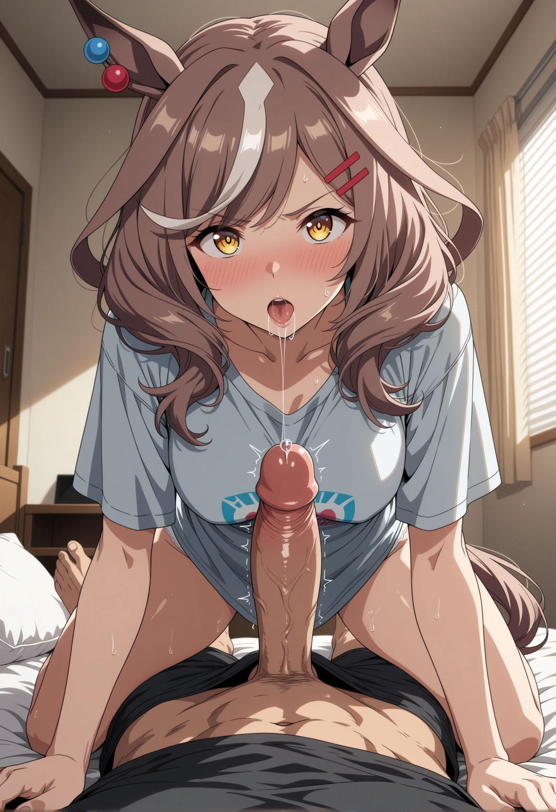

# Morning Ritual

Your back aches. It’s the very first thing you register as the gray pre-dawn light filters through the slanted blinds of your Tracen Academy trainer’s room. You shift on the firm mattress and immediately wince, a sharp hiss escaping your teeth. A tight, scabbed lattice of scratches crisscrosses your shoulder blades, a vivid, stinging reminder of rough pine bark and clutching fingernails. The bite mark resting high on your collarbone throbs with a dull, rhythmic heat, pulsing in time with your heartbeat. Your muscles feel incredibly heavy, drained of energy, yet deep in your marrow, you are still humming with the residual electricity of last night's Obon festival. 

You rub the sleep from your eyes with the heels of your hands. The scent of crushed pine needles, damp earth, and dried sweat still clings stubbornly to your skin, entirely overpowering the generic body wash you used during the hasty shower you managed before collapsing into bed a few hours ago. 

The digital clock on the nightstand bleeds red into the gloom: 4:13 AM.

A soft click echoes from the hallway. You push yourself up on one elbow, the thin cotton blanket slipping down to pool at your waist. The cool air conditioning of the dorm room bites at your bare chest, raising goosebumps. 

The door eases open by inches, the hinges silent. Matikanetannhauser slips inside like a thief in the night. She closes the door behind her with excruciating, painstaking care, turning around to face you with a sheepish, lopsided smile. 

"S-sorry," she whispers, her voice raspy from sleep and last night's screaming. "Did I wake you?"

She’s wearing an oversized gray Tracen sleep shirt that completely swallows her petite frame, the hem resting mid-thigh over a pair of simple white cotton panties. Her chestnut hair is an absolute disaster of sleep-tousled static, the stark white forelock sticking up at an impossible, gravity-defying angle. As she shuffles barefoot across the cold linoleum toward the carpeted area around the bed, her movements are gingerly, almost stiff. Her knees still bear faint, bruised smudges that look suspiciously like ground-in moss from the forest floor, and when the oversized collar of her shirt slips off one slender shoulder, you can clearly see angry red friction scrapes along her skin.

She sits on the edge of the mattress, the springs groaning softly in protest. Her weight pulls the bedsheets taut across your legs. The smell of her—peaches, milky soap, and that warm, distinctly musky scent of sleep and lingering arousal—instantly fills the small space between you. 

"Morning," you say, your voice gravelly.

Her ears give a rapid, nervous twitch. The red and blue beads braided into her right ear jingle faintly, a delicate, crystalline sound in the quiet room. She reaches up, her fingers finding the beads by habit, rolling the smooth glass back and forth. 

"Morning," she echoes. She avoids your gaze entirely, staring with intense, manufactured fascination at a wrinkle in the duvet cover. "I, um... I couldn't sleep. Kept waking up. The bed in my dorm felt too... big. And empty."

Her tail, poking through the tailored slit in the back of her shirt, gives a restless, agitated flick against the blankets, brushing against your calf.

"Are you sore?" you ask, noticing how she shifts her weight off her scraped shoulder, her posture slightly crooked to compensate for the aches.

"A little," she admits, a deep flush creeping up her neck to warm her cheeks. "But... well, it’s a good kind of sore? I think? Like after a really, really hard training run. But..." She swallows hard, her Adam's apple bobbing. "Mostly I'm just nervous. The race is today."

Right. The Nakayama prep race. 

"You're going to do great," you tell her, keeping your tone steady and reassuring.

"I’m going to trip right out of the starting gate," she blurts, her ears flattening instantly against her head in distress. "I just know it. Or I'll forget the pacing plan on the backstretch and blow all my stamina on the second turn. Or—or my shoe will come off in the mud!"

You reach out, resting your hand over her fidgeting fingers, stilling them. Her skin is very warm, almost feverish. "Breathe, Machitan."

She takes a shaky, ragged breath, her amber eyes finally darting up to meet yours. The blush on her cheeks deepens to a furious, sunburned crimson. Her ears perk up slightly, twitch once, then immediately flatten again in absolute embarrassment. 

"Actually, Trainer... that's kind of why I'm here." She bites her lower lip, pulling the soft pink flesh between her teeth. "I read—well, not read, exactly. Someone said... or I saw it on a message board, maybe? But, um. I read that... that a trainer’s... um. That it has a lot of protein. And, like, vital energy?"

You blink, trying to parse the sudden, baffling left turn through your sleep-fogged brain. "What does?"

Machitan squeezes her eyes shut tight, looking like she's bracing for an impact. "Your cum!" she squeaks, the word tearing out of her like a pulled rip cord. Her face is burning so hot you can practically feel the heat radiating off her skin in the cool room. "For stamina! It’s—it’s supposed to give a big stamina boost before a race. Because of the, um, the vital essence."

She is deadly serious. The pure, earnest conviction in her voice is entirely, uniquely Machitan. She wants to believe this highly dubious internet rumor because she desperately wants an excuse to touch you again. 

"Machitan, I don't think physiology works like—"

"P-please?" she stammers, dropping to her knees on the floor beside the bed. The oversized shirt rides up her thighs, exposing more of the faint moss stains on her kneecaps. "Just... just let me. I need the stamina, Trainer. I really do."

Before you can argue the scientific merits of her claim, her trembling hands are gripping the edge of the blanket and pulling it down from your waist. The cool pre-dawn air hits your bare skin, making you shiver. You're already half-hard from the morning, your erection pulsing sluggishly against your thigh, but as she pushes your boxer briefs down, dragging the cotton over your skin, the blood rushes south in a hot, heavy wave. 

She looks at your cock with wide, awestruck eyes, as if she hasn't seen it just hours ago bathed in moonlight. Her breath hitches, a soft puff of warm air ghosting over your ultra-sensitive skin. 

"It's... already waking up," she murmurs. Her voice loses its nervous, high-pitched edge, replaced by a breathy, unpolished need that makes your pulse hammer in your throat. 

She doesn't try to be seductive. There’s no slow, practiced teasing, no sultry looks through her lashes. She just leans in, her small hands gripping your thighs for balance, her nails digging slightly into your muscle, and opens her mouth. 

Her lips are soft, slightly chapped from last night, and incredibly hot. She takes the head of your cock into her mouth with a clumsy, eager lunge. The staggering contrast between the cool room and the wet, scalding heat of her mouth makes your hips jerk upward involuntarily. Machitan makes a startled, muffled sound against you, but she doesn't pull back. 

Instead, her tongue darts out, broad and flat, dragging heavily over the slit and down the sensitive underside of the shaft. She tastes like morning breath and sharp mint toothpaste. Her technique is messy—she uses a little too much teeth at first, the dull edge scraping lightly against the thin skin, before she quickly adjusts, sucking you in with a frantic, wet slurp. 

You let out a low, ragged groan, your head falling back against the pillow. The mattress squeaks steadily as you shift your weight, trying to accommodate her angle. 

"You don't—ah—you don't have to do this just for the race," you manage to say, your voice straining as she swirls her tongue around the corona. 

Machitan pulls off you with a loud, wet pop, a shiny string of saliva stretching between her bottom lip and the tip of your cock before finally snapping. 

"I want to," she says, her voice thick and gravelly. Her amber eyes are glazed and dark, fixed entirely on your lap. Her tail is flicking rapidly now, a steady, rhythmic thwack-thwack-thwack against the wooden bed frame. "I want to taste you again."

She dives back down. This time, she takes you deeper. She gags softly, a wet, choking sound in the back of her throat as it constricts around the head of your cock, but she forces herself to swallow, taking more of your length past her lips. Her nose bumps awkwardly against your pubic bone. She breathes heavily through her nose, the hot, rhythmic puffs of air fanning across your skin and scattering goosebumps down your thighs. 

It’s sloppy, wet, and incredibly raw. She bobs her head, the static-filled chestnut hair brushing against your stomach. Her left hand comes up to grip the base of your shaft, a tight, desperate hold, compensating for what her mouth can't quite reach. Her small fingers squeeze tight—almost painfully tight—and she pumps her hand in rough time with the jerky movements of her head. 

The sensory overload is immediate and absolute. The tight, dry friction of her hand, the hot, slick suction of her mouth, the smell of her milky soap mixed heavily with the undeniable, sharp tang of arousal filling the air. The faint, musical jingling of her ear beads provides a chaotic, delicate rhythm track to the crude, wet sounds of her mouth working over you. 

Her ears are perked forward, alert and intensely focused, twitching occasionally. Every time you twitch or groan, her ears flick, registering your response, and she adjusts her grip or the pressure of her mouth, trying to figure out exactly what feels best. She's learning on the fly, driven by that stubborn, earnest determination that makes her who she is. 

The pleasure begins to coil tightly in your lower belly, a hot, heavy tension that winds tighter with every clumsy, eager bob of her head. You reach down, your fingers tangling in the messy chestnut hair at the nape of her neck. You can feel the faint, raised scratches on her shoulder blades through the thin cotton of her shirt. 

"Machitan," you breathe out, your hips beginning to buck upward on their own, chasing the heat of her throat, completely abandoning the pretense of staying still.

The pace of her hand increases, her grip now perfectly slick with her own spit running down the shaft. The friction is sharp, precise, contrasting perfectly with the soft, wet cavern of her mouth. Her tail is practically vibrating against the bed frame, the rapid thumping sound filling the quiet room. 

You are incredibly close. The pressure behind your groin is building to a critical mass, a dam ready to burst. The throbbing in your cock matches the heavy, rhythmic throb of the bite mark on your collarbone. Your breathing turns ragged, harsh pants echoing in the silent, gray room. You tighten your grip on her hair, your thumb stroking the sensitive, velvety base of her horse ear. 

She whimpers around your cock, a high, needy sound, the vibration of her vocal cords humming directly into your flesh. She feels the distinct change in you. She feels the rigid, pulsing tension, the way your hips lock into an upward thrust, signaling the inevitable end. 

Just as the dam is about to break, just as the very first spasm threatens to tear through you and ruin you, Machitan suddenly pulls back. 

The immediate loss of heat and pressure leaves you gasping, your hips thrusting once into empty, cool air. You open your eyes to see her kneeling over you, panting softly, her chest heaving under the oversized shirt. Her lips are swollen and wet, glistening brightly in the dim, gray light. A thick strand of saliva connects her open mouth to the slick, shiny head of your cock, hovering just inches away. 

Her amber eyes are blown wide, pupils dilated so far there's barely a ring of gold left. Her ears are pinned completely flat against her head, a chaotic mix of intense focus, overwhelming arousal, and deep embarrassment. 

"Not yet," she stammers. Her voice is trembling, completely wrecked with lust. She swipes a clumsy thumb across her wet chin, smearing the spit. "I want... I want to make sure I get it all. I can't spill any. F-for the stamina."

She licks her lips, her gaze locked hungrily on the throbbing, weeping head of your cock. The raw, unfiltered hunger in her expression is staggering, completely at odds with her usual clumsy, cheerful demeanor. 

"I’m going to drink every drop, Trainer," she whispers, the words clumsy but carrying a deadly earnestness. 

Before you can form a coherent thought, before you can even drag in a much-needed breath, she leans forward. Her hot, wet mouth closes over you once again, swallowing you whole with a wet, vacuum-tight slurp. The suction is absolute, and the tension instantly snaps right back into place, pulling you agonizingly close to the edge, leaving you teetering over the precipice.
