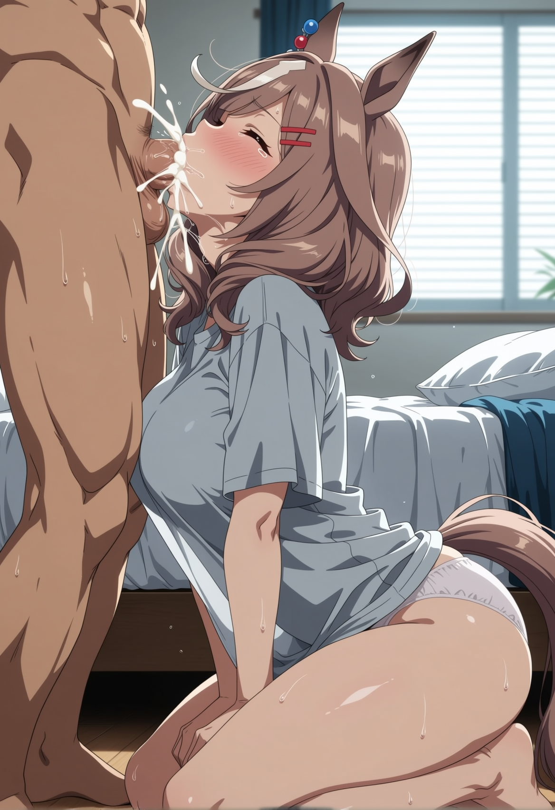
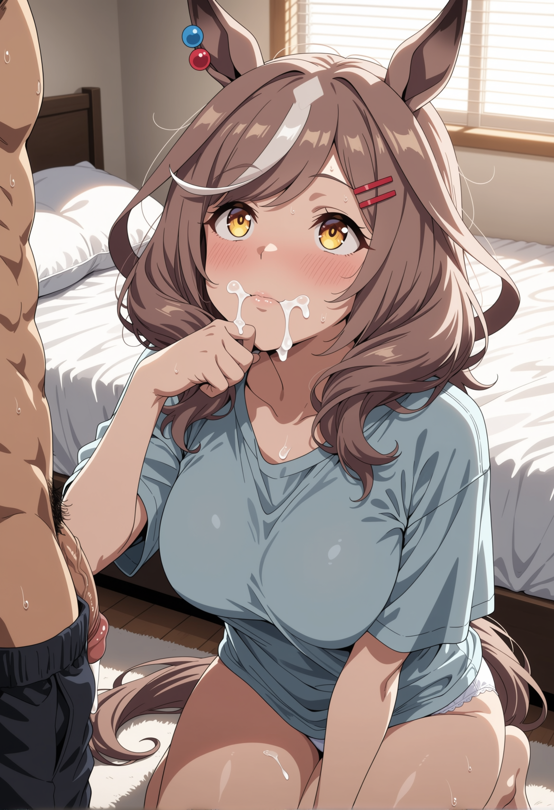
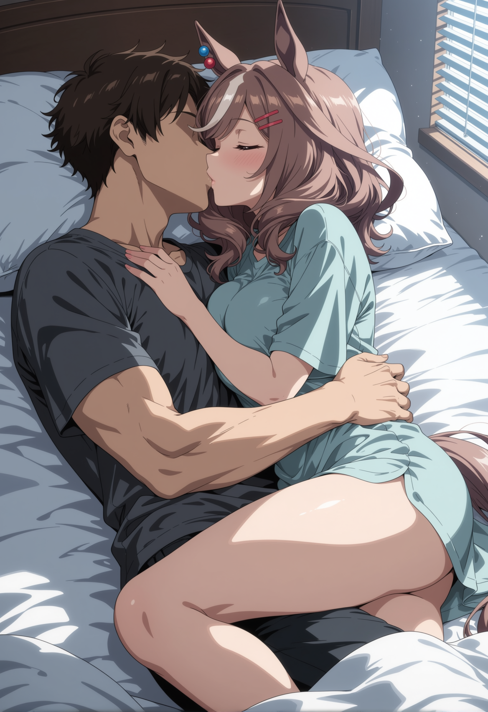
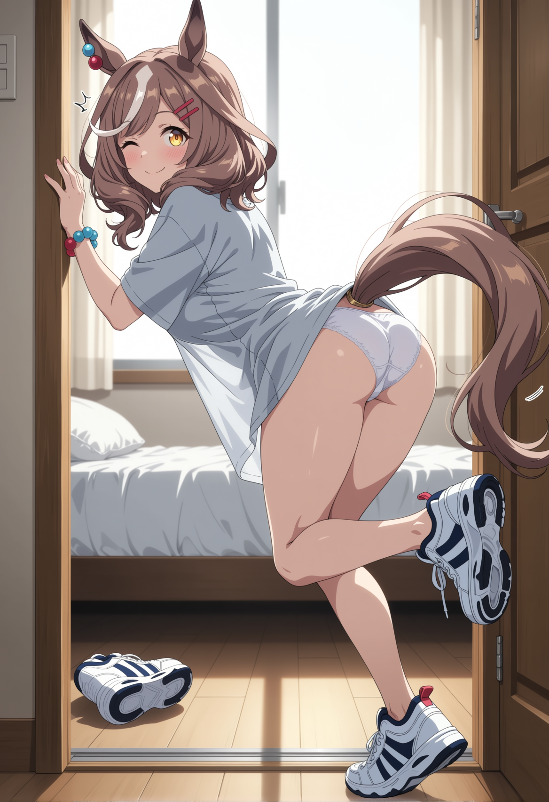

# Fuel

Her lips seal around your base, creating a vacuum so intense the world reduces to the point of contact, to the wet, burning friction of her tongue wrapping around the underside of your shaft. You are already at the breaking point, every muscle in your thighs locking up as her throat flexes against you in a rhythmic, desperate pull. Her ears are pinned absolutely flat against her messy chestnut hair, the red and blue beads on her right ear completely still in her singular focus. The air in the room is thick with the smell of sweat, arousal, and the metallic tang of damp earth clinging to her knees, but all you can focus on is the searing heat of her mouth drawing the climax straight out of your spine.

"Machitan—" you manage, your voice fracturing in the dim, pre-dawn quiet. 

Her tail goes completely rigid against the bedframe with a soft *thud*. You tip over the edge.

The release hits like a lightning strike, a blinding rush of heat that forces a harsh groan from your lungs. You pulse into her, the first thick flood of it hitting the back of her throat, and true to her word, she doesn't flinch. She doesn't pull away. Instead, she presses her hands down harder on your thighs, anchoring herself, and swallows heavily. You can feel the distinct, rhythmic clench of her throat muscles working, taking everything you give her, the suction tightening with every aftershock. 

It’s overwhelming—the hot slickness of her mouth, the soft slide of her tongue dragging along your frenulum, coaxing out every last drop. A soft, muffled whine vibrates in her chest, translating directly into the sensitive skin of your cock. She swallows again, a wet, audible gulp that echoes in the stillness of the room, her amber eyes screwed shut, her brow furrowed in fierce determination. The heat of her breath washes over your damp skin as the pulses begin to slow, yet she stays locked around you, nursing the final twitches with a gentle, agonizingly slow bob of her head. 

Only when your hips finally drop back against the mattress, utterly drained, does she slowly slide upward. Her lips pop off the head with a wet *schlick*, leaving the skin gleaming in the faint light filtering through the blinds. 

She stays kneeling on the floor, panting softly through her nose. A thin line of white clings to the corner of her swollen, pink lips. Her eyes flutter open, the pupils still blown wide, the amber rings slowly re-expanding as the haze of the moment begins to lift. 

For a long second, neither of you says anything. The only sounds are the hum of the mini-fridge in the corner and the heavy rasp of your breathing. 

Machitan lifts the back of her hand and wipes her mouth, smudging the wetness across her cheek. Her ears slowly pivot forward, the tension draining out of them, and the stiff rod of her tail drops, beginning a slow, lazy, deeply satisfied swish across the carpet. 

She swallows one final time, clearing her throat, and looks up at you with an expression of profound, scholarly seriousness. 

"Wow," she croaks. She clears her throat again, her voice returning to its normal pitch. "I— um. I can really feel it working." 

You let out a breath that’s half-laugh, half-disbelief. "The... stamina." 

"Yes!" She nods emphatically, causing her white forelock to bounce against her forehead. The red and blue beads jingle softly. She rolls her shoulders, testing the muscles, her oversized gray sleep shirt shifting over her collarbones. "It's like... liquid energy. I feel completely fortified. My legs feel great. I think my top speed just increased by at least three percent." 

The sheer earnestness in her voice, paired with the fact that she is currently kneeling on the floor in her panties with your cum on her breath, is a whiplash so severe it makes your chest ache with fondness. 

"Get up here," you say softly, reaching down and catching her by the wrist. 

She lets you pull her up. She scrambles onto the mattress, her cool, slightly clammy hands resting against your chest as she settles into the crook of your arm. Her skin radiates heat, and the scent of her—sugar, sweat, and something distinctly musky—fills your senses. You tilt her chin up and press a kiss to her forehead, then down to her lips. She tastes like salt, like skin, and distinctly like you. 

She hums against your mouth, leaning into the touch for a brief, warm moment. Her tail curls around your ankle under the sheets.

But almost as soon as she settles, a subtle shift courses through her body. The lazy swish of her tail stops. Her ears flick upright, swiveling toward the window where the sky is just beginning to bleed from pitch black into deep, bruised purple. 

The spell breaks. The race day energy, completely irrepressible and buzzing with static, floods back into the room. 

"Oh gosh, what time is it?" she blurts out, pushing herself up so fast she nearly headbutts your chin. She scrambles toward the edge of the bed. "I have to get back to my dorm. Nice Nature is going to kill me if she wakes up and I'm gone. I have to get my silks on. The Team Canopus colors! I need to eat breakfast—real breakfast, I mean, not just—um—" She flushes violently, her hands waving in a panicked flurry. "Carbs! Rice! Natto!" 

"Machitan, breathe. It's four-thirty. You have time." 

"There's never enough time on race day!" she insists, swinging her legs over the edge. She hits the floor with a solid thud, takes one determined step toward the door, and immediately catches her toe on the heel of your sneakers left carelessly by the bed. 

She pitches forward with a yelp, her arms pinwheeling. She manages to catch herself against the doorframe before eating the carpet, her tail puffed out like a startled cat's. 

"I'm okay!" she announces to the room at large, breathless, pushing herself upright. She looks down at the shoes, then back at you, a sheepish, self-deprecating laugh bubbling out of her. "Just... practicing my break from the gate. Getting the clumsy out early." 

You sit up against the headboard, pulling the sheet over your lap, watching her with a smile that you can't suppress. "You're going to do great today." 

She pauses in the doorway, her hand on the brass knob. The frantic, scrambling energy settles into something deeper, something profoundly grounded. The dim light from the hallway catches the sharp, serious set of her jaw, the bright, fierce amber of her eyes. It's the look she gets when the gate opens. 

"Trainer," she says, her voice quiet but carrying perfectly across the small room. 

"Yeah?" 

"Watch from the rail today," she asks, not a demand, but a plea laced with absolute determination. "Don't sit in the stands. I want... when I come down the final straight, when it starts hurting and I need to dig deep... I want to see you right there. Okay?" 

You don't hesitate. "I'll be on the rail. Right at the finish line." 

Her ears perk high, the beads clicking together. A massive, brilliant grin breaks across her face—the kind of grin that can weather any storm, any slip-up, any grueling stretch of turf. 

"Okay," she breathes. "I'll see you there." 

She slips out into the hallway, pulling the door shut behind her with a soft *click*. 

You lie back against the pillows, the room suddenly feeling very empty and very quiet. The ghost of her heat still lingers against your side, the faint taste of her still on your lips. You stare up at the ceiling as the first true slivers of gray morning light begin to filter through the blinds, feeling the lingering ache in your muscles and the heavy, thrumming anticipation in your chest. 

It’s race day. And thanks to you, Machitan is completely fueled up. 

You throw the sheets back and swing your legs out of bed. Time to get ready.
