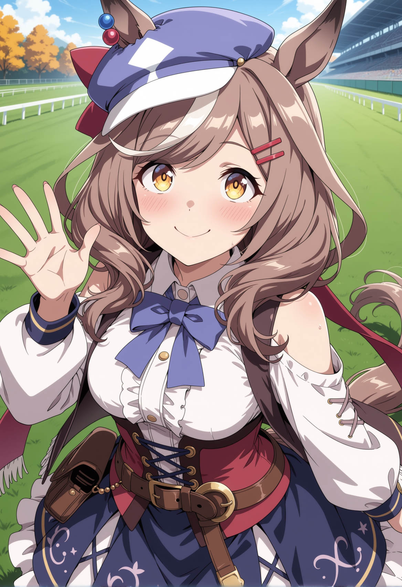
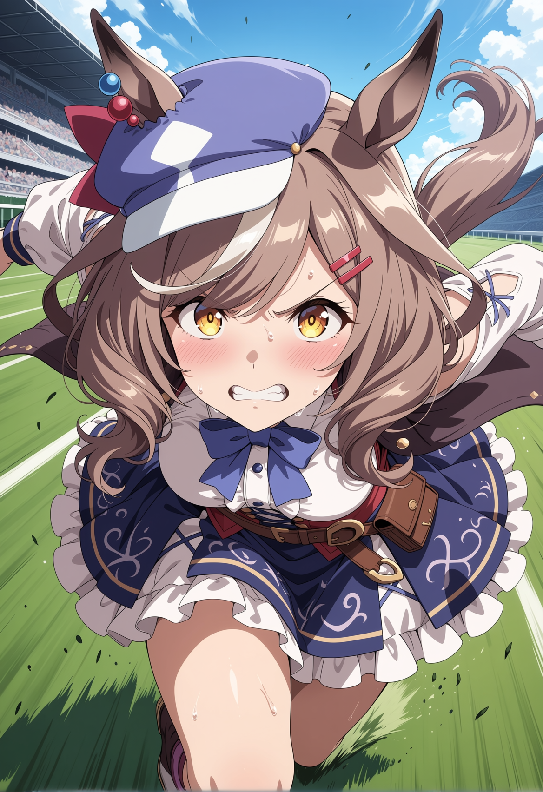
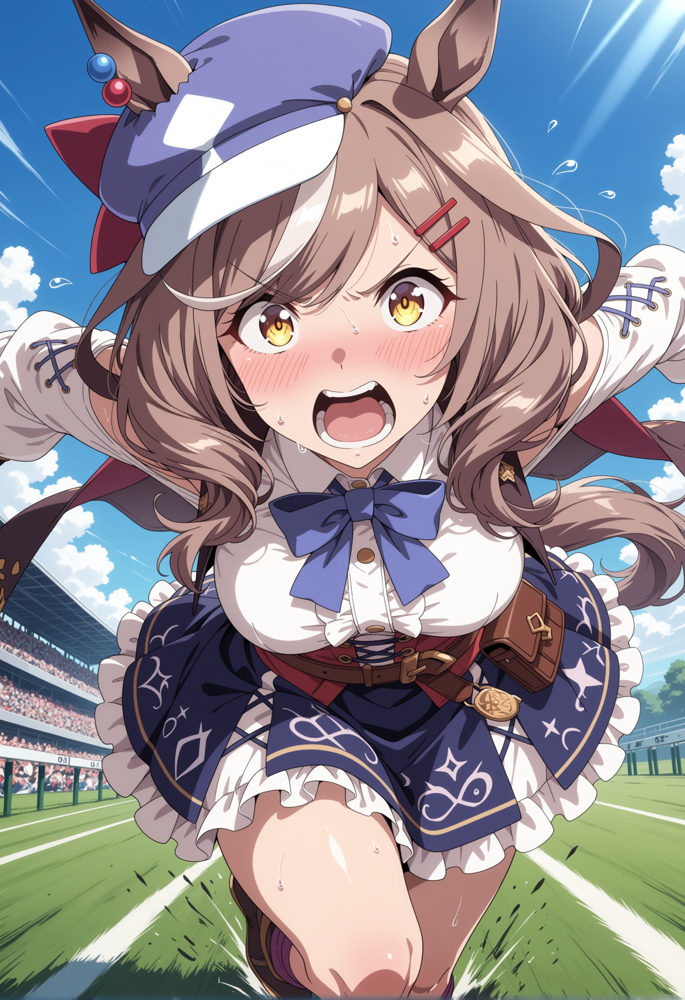
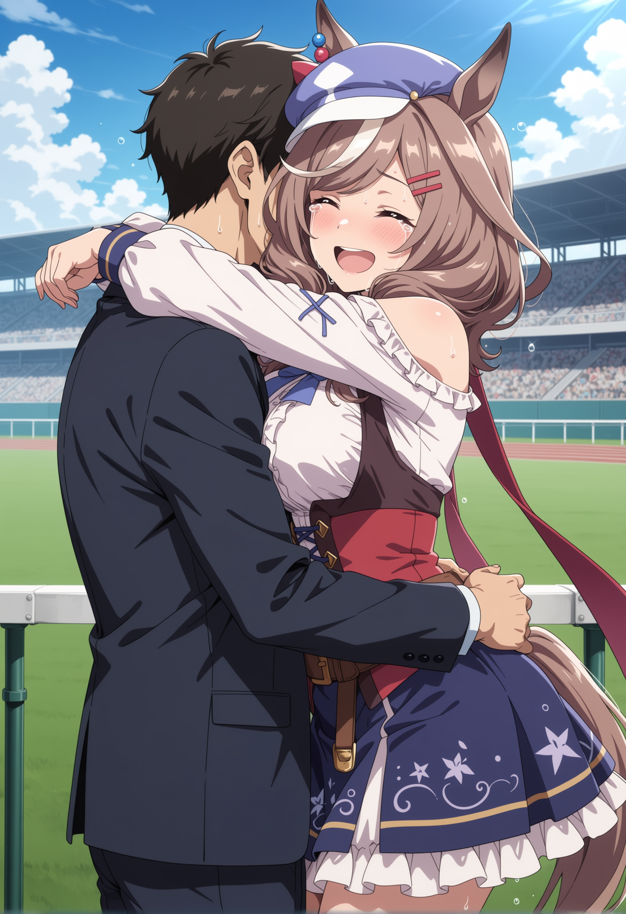

# The Longest Furlong

The turf smells sharp—like crushed blades, damp, rich soil, and the unmistakable electric charge of anticipation. You lean your weight against the white plastic rail, the cold metal vibration of the PA system humming beneath your forearms. The grandstand behind you is a sheer, towering wall of noise. It’s a chaotic ocean of overlapping chatter, the rustling of a thousand racing programs, the distant clatter of glass bottles, and the heavy, buttery aroma of vendor popcorn cutting through the autumn breeze. The air is cool, biting at your cheeks, but the sheer volume of bodies around you radiates a dull, stifling heat.

Down in the paddock, the Umamusume parade in their endless, slow circles. Machitan looks impossibly small among them. There are girls here with glossy, flawless coats, girls carrying haughty expressions and muscles that look carved from solid marble. They walk with practiced grace, their tails swishing with measured arrogance. And then there is Machitan. She fidgets. She stretches her calves, straightens the sleeves of her Team Canopus silks, adjusts the stiff collar, and immediately misjudges the distance to a chalk lane marker. Her toe catches it. She stumbles forward, catching herself with a clumsy, panicked windmill of her arms.

The crowd of spectators doesn’t even blink. A few men in the front row mark their tip sheets with red pens, their eyes sliding right past her as if she were made of glass. When the announcer’s voice cracks over the speakers to read the lineup, her name—*Matikanetannhauser*—gets a polite, scattered flutter of applause. She’s an underdog. A long shot on a good day, the kind of runner people throw a hundred yen at just for the payout.

You grip the rail. The plastic squeaks under your tightening fingers. Your knuckles pale. Down below, she glances your way. She searches the sea of suited trainers and finds you. Her face breaks into a nervous, lopsided smile. Her right ear twitches, the blue and red beads jingling with a sound too soft for you to hear over the din, but you know the precise rhythm of it. She lifts her hand in a small, awkward wave, nearly bumps into the handler leading the girl ahead of her, mutters a frantic apology, and jogs toward the tunnel.

The starting gates gleam under the stadium lights. Two thousand meters. Middle distance. The turf is rated firm.

As they load into the gates, you watch the massive high-definition monitors. Stall seven. She steps in, catches her heel on the edge of the rubber mat, and bumps her shoulder hard against the padded steel wall. Classic Machitan. She shakes it off, rubbing her arm, before settling into her crouched stance. Her ears flick back, listening to the starter.

The stadium holds its breath. The silence is a physical weight, a sudden vacuum pressing against your chest.

*Clang.*

The gates fly open. The bell rings, a sharp, metallic shriek that makes your teeth ache.

They break.

She’s slow. Not dead last, but a vital fraction of a second behind the explosive, perfectly timed surge of the frontrunners. A grey Umamusume in stall six cuts sharply across the turf, her spikes tearing up chunks of dirt, forcing Machitan to check her stride before she’s even built speed. She drops back into the pack, swallowed instantly by the thundering mass of bodies. The ground begins to tremble under your boots—the rhythmic, earth-shattering drumbeat of twenty racing girls accelerating to sixty kilometers an hour.

The crowd roars, a sudden detonation of sound, their attention locked entirely on the leaders. A tall girl in black and gold silks is setting a blistering, punishing pace, opening up a two-length lead by the first turn. The dirt flies in high, dark arcs behind her.

You search the pack, your eyes burning from staring too hard. Your knuckles are white on the rail, the plastic digging deep into your skin.

There she is. Running mid-to-back, stuck on the inside rail. Boxed in on three sides.

The middle of the race is a brutal war of attrition. The wind whips past you, carrying the heavy scent of sweat and torn grass. As they hit the backstretch, the formation tightens. The girls are fighting for every inch of turf. A bulky runner on Machitan’s right drifts inward, throwing a heavy shoulder check that would stagger a normal girl, sending her stumbling into the rail.

Machitan takes the hit. Her stride breaks for a fraction of a second, her frame jolting visibly on the monitor, but she doesn’t fall back. She absorbs the impact, her boots chewing deep into the turf, and just keeps pushing. She doesn't have the explosive, terrifying acceleration of the favorites. What she has is the rhythm of a metronome that refuses to stop ticking.

Every stride is identical to the last. While the girls around her start to pant, their coats darkening with sweat, their forms getting sloppy as the lactic acid builds in their thighs, Machitan’s form stays stubbornly, annoyingly perfect. She eats the ground one agonizing meter at a time.

She’s like water cutting through stone. Relentless. Slowly, almost imperceptibly, she starts to move up.

They hit the final turn. The pack begins to stretch, the physical toll tearing the formation apart. The girls who burned too hot, too fast, start dropping back, their chests heaving, their strides shortening.

Machitan finds a seam. A narrow gap between two fading runners.

She slips past one. Then another.

The crowd’s roar changes pitch—from a steady, roaring drone to a rising, jagged wave of genuine excitement. They see it now. They can't ignore it. The little girl in the Canopus silks is eating up the outside rail.

"And here comes Matikanetannhauser on the outside, finding another gear!" the announcer shouts, the speakers buzzing with the sheer volume of his voice.

The home stretch. Four hundred meters to go.

She’s in fourth. Then third.

The leader, the tall girl in black and gold, is still three lengths ahead, but her face is a mask of desperate effort. Her tail is lashing erratically. The girl in second place is fading fast, her legs heavy.

Machitan blows past second place like she’s standing still.

Two hundred meters.

Her ears pin completely flat against her head. The pure aerodynamics of unadulterated focus. Her tail streams rigid behind her, straight as a spear shaft, a banner in a gale. Her arms pump, driving her forward, every ounce of her energy channeled directly into the dirt beneath her feet.

She’s closing.

Two lengths.

You lean so far over the rail you can feel the physical wind of their passage as they thunder past. The smell of hot leather, heavy sweat, and churned earth hits the back of your throat.

One length.

Her mouth is wide open, pulling in ragged, desperate gasps of air. Her eyes are locked entirely on the wire. Every fall, every scraped knee, every nosebleed, every single time she tripped on a perfectly flat surface—it’s all condensed into these final, brutal strides. The sheer, unyielding stubbornness of getting back up, weaponized into pure speed.

Half a length.

The leader glances back over her shoulder, panic flashing in her wide eyes. It’s a fatal mistake. It breaks her rhythm, her stride faltering for half a beat.

Machitan doesn’t look. She doesn't breathe. She just runs.

The finish line flashes past. They cross it in a chaotic blur of motion, a tangle of pumping limbs and flying turf.

It’s too close. A nose. Maybe a neck. The naked eye can't tell.

The crowd is on its feet, screaming itself hoarse. You can’t breathe. Your heart is hammering against your ribs like a trapped bird, frantic and heavy. You taste copper in your mouth and realize you've bitten through your lower lip.

The girls slow to a jog, their chests heaving, coats slick and dark with sweat. Machitan is bent double, hands resting heavily on her knees, gasping for air. Her chest rises and falls in violent, shuddering heaves. Her tail drops, limp and exhausted.

The stadium falls into a tense, buzzing murmur. All eyes turn upward to the massive digital board above the grandstand.

*Photo Finish.*

The seconds stretch into an unbearable eternity. The wind is suddenly freezing against your sweating skin.

The board blinks. The pixels rearrange.

*1st: 7 - Matikanetannhauser*

The eruption of noise is deafening. It’s a physical wall of sound that hits you directly in the chest, vibrating through your bones.

Down on the track, Machitan freezes. She slowly straightens up, staring at the board. Her chest is still heaving violently. For a long, silent second, she just stands there, utterly unable to process the glowing numbers next to her name.

Then, her ears shoot straight up, rigid and alert.

She looks around, her eyes wide, wild, and shining with sudden, wet tears. She scans the chaotic crowd, looking lost and disbelieving, until she finds you leaning over the rail.

Her face breaks into a grin so bright it physically hurts to look at.

She starts running again. It is not a graceful victory lap. She trips over a clump of torn turf, stumbles wildly, catches herself with a flail of her arms, and keeps coming. She practically throws herself over the low plastic rail.

She crashes into you.

It’s a clumsy, heavy impact. Her arms lock around your neck, nearly knocking you backward onto the concrete. She’s laughing and sobbing at the exact same time, a chaotic, breathless, beautiful sound. Her racing silks are soaked, dark with sweat, pressing wet and hot against your chest. She smells like torn turf, heavy exertion, and the unmistakable, electric scent of victory.

Her right ear brushes against your cheek, the red and blue beads jingling frantically in a joyous, erratic rhythm.

"I won," she whispers into your ear, her voice trembling and raw. She sounds like she’s testing the words, rolling them around on her tongue to make sure they’re real. "I— I actually won."

You wrap your arms around her waist, lifting her just a fraction off the ground. She feels solid, warm, and overwhelmingly alive in your grip. The crowd is still cheering, roaring her name, but all you can hear is her ragged breathing and the soft jingle of her beads.

She buries her wet face into your shoulder—right into the spot with the faint, lingering ache of the bite mark from last night. It stings sharply.

You don't care at all. You just hold her tighter.
