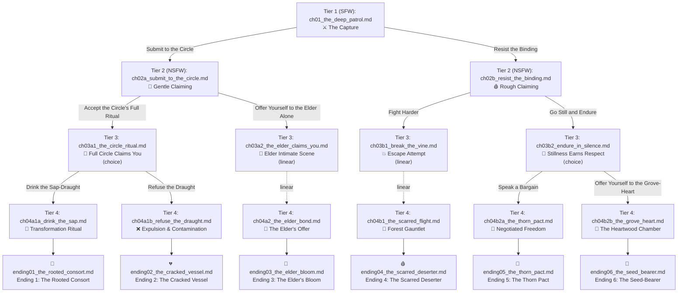

# Branching Graph: *The Grove of Thorn and Sap*

A choice-driven NSFW interactive story across **5 levels of depth** culminating in **6 unique endings**.

---

## Complete Mermaid Diagram

---

## Path Directory & Verification

| Path | Tier 1 | Tier 2 | Tier 3 | Tier 4 | Tier 5 (Ending) |
| :--- | :--- | :--- | :--- | :--- | :--- |
| **Path 1** | `ch01_the_deep_patrol.md` | `ch02a_submit_to_the_circle.md` | `ch03a1_the_circle_ritual.md` | `ch04a1a_drink_the_sap.md` | `ending01_the_rooted_consort.md` |
| **Path 2** | `ch01_the_deep_patrol.md` | `ch02a_submit_to_the_circle.md` | `ch03a1_the_circle_ritual.md` | `ch04a1b_refuse_the_draught.md` | `ending02_the_cracked_vessel.md` |
| **Path 3** | `ch01_the_deep_patrol.md` | `ch02a_submit_to_the_circle.md` | `ch03a2_the_elder_claims_you.md` | `ch04a2_the_elder_bond.md` | `ending03_the_elder_bloom.md` |
| **Path 4** | `ch01_the_deep_patrol.md` | `ch02b_resist_the_binding.md` | `ch03b1_break_the_vine.md` | `ch04b1_the_scarred_flight.md` | `ending04_the_scarred_deserter.md` |
| **Path 5** | `ch01_the_deep_patrol.md` | `ch02b_resist_the_binding.md` | `ch03b2_endure_in_silence.md` | `ch04b2a_the_thorn_pact.md` | `ending05_the_thorn_pact.md` |
| **Path 6** | `ch01_the_deep_patrol.md` | `ch02b_resist_the_binding.md` | `ch03b2_endure_in_silence.md` | `ch04b2b_the_grove_heart.md` | `ending06_the_seed_bearer.md` |
