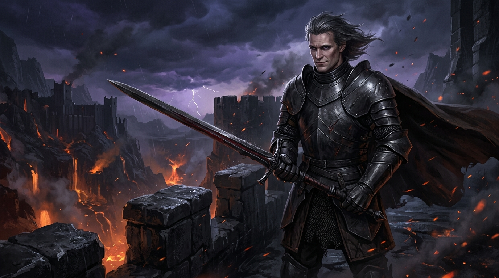

# Chapter 7: The Scraps of Althea

### Part I: Briony

The attic garret in the Lower Flumes smelled of stale vinegar poultices, sour sweat, and rot.

I lay on a lumpy straw pallet beneath a leaking slate roof, every heartbeat sending a white-hot spike of agony through my shattered left shoulder. The splints were gray with dried drainage; the wound-fever had my teeth chattering even though my skin burned like hot coals. Across the room, curled in the dark corner like a whipped dog, sat Morwenna. Her crystal staff was in splinters, her face wrapped in dirty rags that wept yellow fluid where her magic had backfired.

Down below, in the alley courtyard, heavy iron fists were hammering against the street gate.

"Open up, Morn!" a bailiff’s voice roared through the rain. "By order of Factor Osric and the Duke’s High Bailiff! Five thousand crowns for the abandoned wagons, or the debt-chains come out!"

Inside the room, Lysander paced the floorboards like a rabid animal.

His immaculate golden curls were greasy and tangled, plastered to his forehead with sweat. His ermine-trimmed scarlet cloak was gone—pawned yesterday to pay for two days of bread and cheap wine. His handsome face was twisted into a feral, petulant snarl that made my stomach turn. For months, I had thought him a god stepped down from the heavens; now, watching him kick an empty cider jug against the wall, I saw only a spoiled, terrified child.

"It's his fault," Lysander hissed, his fingernails digging into his palms until blood welled beneath the rings. "That peasant bastard. That ink-stained worm. He planned this! He held back the beast surveys on purpose so we would fail!"

"Lysander..." Althea spoke from the edge of the wash-stand. 

Her green hunting suede was torn at the knees, her hair dull, her eyes rimmed with red. But unlike Morwenna and me, she was whole. Her bones were unbroken. 

Lysander stopped in front of her. 

He reached into a battered leather valise, pulling out a gown of soft gray wool and a small glass phial of cheap lavender water. He thrust them into her chest.

"Put them on," he commanded, his voice trembling with frantic, desperate energy. "Wash your face. Scent your hair. You're going down to the Cinder-Gorge."

Althea blinked, clutching the wool to her ribs. "The gorge? Lysander, the bailiffs are at the gate—"

"You go through the cellar drain!" Lysander seized her by the shoulders, shaking her with enough force to rattle her teeth. "You go to Caspar! He spent seven years drooling over you, Althea! Seven years fetching your arrows and blush-staring at your skirts! You put on this dress, you unbutton your collar, you cry on his chest! You tell him I forced you! Tell him you realize you only ever loved him! Offer him your bed—give him whatever he wants, all night long if you have to! Just get his seal on the star-iron deed!"

A cold shudder ran through my fevered bones. 

I hauled myself up onto my right elbow, gasping as the agony flared in my shattered collarbone. 

"Lysander... no," I croaked, my voice rough and cracked from fever. "Don't send her. You don't know what you're doing."

Lysander turned on me, his lip curling in disgust. "Shut up, Briony."

"Listen to me!" I pleaded, dragging myself an inch across the dirty straw. "You didn't see Gallow-Gate Lane! You didn't look at Joram’s pulverized jaw or Skeg’s severed spine! Caspar didn't just survive an ambush—he slaughtered three seasoned killers with his bare hands in twenty seconds! He moved like smoke! He smiled while he cut their throats! That isn't the clerk who loved her, Althea! He's a monster! If you go down into that volcanic pit, you're walking into a furnace!"

Lysander took two strides across the room and kicked the edge of my pallet. 

The jolt sent a shockwave of agony through my shoulder that made me scream, bile rushing into my mouth.

"I told you to shut your mouth, you broken cow!" Lysander snarled, towering over me with his fists clenched. "A street gang jumped those thugs for the ten groats! Caspar Thorne is a peasant who flinched when a dog barked! The moment Althea sheds three tears and touches his arm, he will be on his knees kissing her feet, weeping with gratitude!"

He turned back to Althea, his voice turning frantic, wheedling. "You can do this, Althea. You remember how he looked at you. You had him on a leash. Do this for us, and when the deed is mine, I will buy you silk from the capital. I'll make you a high lady."

Althea looked down at the gray wool gown. 

She turned to the cracked shaving mirror on the wall. She unbraided her hair, letting the ash-brown waves fall across her shoulders, dabbing the lavender water onto her throat and collarbone. 

A small, familiar smirk began to touch the corners of her mouth—the same arrogant, self-satisfied smile she had worn at *The Salt & Grackle*.

"Briony is just terrified because she’s crippled," Althea said softly, smoothing the wool over her hips. "Caspar loved me. He was obsessed with me. He carried my packs through the mud for three years. He’s probably sitting in that sulfur hole right now, weeping over my memory, praying I’ll come back."

She turned toward the door, her chin held high. "I'll have the deed before midnight, Lysander."

I lay back in the straw, clutching my throbbing shoulder, watching her slip through the garret trapdoor into the rain.

*You fool,* my mind screamed into the dark, remembering Joram’s single, terrified eye in the alley muck. *You stupid, vain fool. You're walking straight to the butcher.*

***

### Part II: Daemon

The road down into the Cinder-Gorge had been transformed into an unyielding artery of war. 

Where once only wild goats picked their way through poison vents, broad switchback roads now carried iron-banded freight wagons hauled by teams of thick-necked oxen. Twin watchtowers of black basalt mortared with volcanic ash flanked the narrowest choke-point, manned by my arbalestiers in matte plate.

I sat in the Great Hearth of the Citadel—a vaulted chamber carved directly into the living basalt above the main thermal flues. It was warm, smelling of burning pitch, hot metal, and the spiced wine I had imported from the southern valleys. Fifty smiths worked at rows of anvils on the lower terrace, their rhythmic strikes sounding like the war-drums of a marching legion.

Across my knees lay *Bloodthorn*, resting unhurriedly in my bare palms.

The iron gate of the upper corridor creaked open. Orrin Pike walked into the hall, his scarred face twisted into a sardonic grin.

"You have a petitioner, my lord," Orrin rasped, resting his hand upon his sword-hilt. "She claims she knows you from the old days."

"Bring her," I said.

Althea walked into the firelight.

She had tried to wash away the mud of the Wyrm-Tooth Crags. Her hair was combed into the loose, soft waves the dead boy had once loved, scented with lavender water to mask the lingering smell of horse-sweat and canal rot. She wore a borrowed wool gown of soft gray, pinned tight at the waist to emphasize her slender hips, bought with the last pieces of silver Lysander had managed to scrounge from his creditors.

She stopped ten paces from my stone chair, her knees trembling.

I didn't move. I signed the bottom of Korgan’s foundry manifest, handed the parchment to Orrin, and only then slowly raised my eyes to look at her.

The moment her hazel eyes met mine, the rehearsed smile on her lips froze.

She was looking for Caspar Thorne—the eager, clumsy village boy who used to blush whenever she brushed against his shoulder by the campfire. Instead, she found herself pinned beneath the gaze of Prince Daemon Targaryen: two hooded, violet-flecked lanterns of pure, unyielding majesty.

She fell to her knees upon the basalt flagstones, clasping her hands before her chest, letting tears of practiced vulnerability spill over her pale cheeks.

"Caspar..." she whispered, her voice trembling with exquisite, melodic sorrow. "Please... look at me. Ever since that horrible night at *The Salt & Grackle*... I haven't slept. I haven't eaten."

I leaned back into the wolf-pelts draped over my chair, resting my chin upon my knuckles. "A pity. Starvation seems a rather dramatic response to a tavern disagreement."

"You don't understand!" she cried, scrambling forward two paces on her knees, her gown dragging in the black stone dust. "Lysander... he bewitched me! He had nobility, wealth, the blessing of the church! When my mother died, I was so terrified of starving, Caspar! I was weak! When he offered me his protection, I thought it was the only way to save us both! But it was an illusion! He is a monster, Caspar! He treats me like a dog! He left Briony and Morwenna to die in the pass!"

She reached up with trembling fingers, unfastening the top two pewter buttons of her bodice, letting the gray wool slip down to expose the curve of her pale throat and the top of her breasts.

"I made a terrible mistake," she whispered, looking up through wet lashes, her voice dropping into a husky, intimate murmur that had probably worked on a dozen village boys before me. "A stupid, childish mistake. But we built this together, Caspar. The fields of Briar-by-the-Fen. The promises we made under the willow tree. My heart was always yours. Take me back. Let me stay here with you. I will cook your meals, wash your linen... I will share your bed every night, just as you always dreamed. Only you."

The Great Hearth went deathly still. 

Master Korgan scowled, spitting onto the hearthstones in disgust. Orrin chuckled—a dry, rasping sound like dry leaves scraping over stone.

I did not move an inch. I looked at her with the cold, sterile boredom of an emperor regarding a soiled floor-mat.

"Tell me, girl," I murmured softly, my voice cutting through the silence like a razor through silk. "Did Lysander write that speech for you before he sent you down the road? Or did you rehearse it together in the back of his rented carriage?"

Althea froze. The color drained from her face in an instant. "What... what do you mean?"

I snapped my fingers.

Orrin stepped forward, drawing a folded parchment from his leather coat and dropping it onto the stones between Althea’s knees. It bore the unmistakable lead seal of Factor Osric, the premier debt-broker of the southern ports.

"Your golden boy owes five thousand crowns to the city treasury for the baggage train he abandoned," I said, my voice conversational and dripping with poison. "His father has publicly disowned him. His accounts are frozen."

I pointed to the document between her hands.

"Three days ago, Lysander signed an indenture deed with Osric. He pledged your body, along with the crippled Briony, to the bordellos of the southern coast if he could not secure the mining rights to the Cinder-Gorge by week's end."

Althea stared at the paper. With shaking, bloodless fingers, she picked it up, her eyes darting across Lysander’s elegant, flowing signature:

*Item: Two female retainers. One archer, sound of body. One berserker, maimed left shoulder (labor value adjusted).*

Her breath caught in a sickening gasp. She dropped the deed as if it had turned to molten slag, clutching her throat as if she were about to vomit.

"No..." she whimpered, rocking back on her heels. "He... he swore he would marry me... he swore if I brought him the star-iron deed—"

"You fool," I said, rising slowly from my stone chair. 

My boots struck the basalt with heavy, measured strides as I walked down the steps of the dais. Althea shrank back, pressing herself flat against the cold flagstones, trembling so violently that her teeth clicked in her skull.

I stopped an arm’s length away, looking down at her.

"You traded iron for gilded tin," I whispered, every syllable burning like acid. "And now you come crawling into my hall with your bodice undone, offering me the scraps of a body you gladly gave to a painted coward while I walked the perimeter in the frost."

"Caspar... please..." she sobbed, clutching at the hem of her skirt. "Have mercy..."

"Caspar Thorne is dead, girl," I said softly. "The weak, groveling boy who loved you died in the puddle of sheep-fat on that tavern table, crushed beneath the weight of your petty, treacherous soul."

I reached into my belt-pouch, withdrew a single battered copper piece, and held it between my thumb and forefinger.

I dropped it.

The coin struck her bare collarbone with a dull *clink*, bounced off the wool of her bodice, and rolled into the dust beside her knee.

"For your performance," I said. "Now gather your skirts and crawl back to your master. Tell him that if he wants the Cinder-Gorge, he will have to take it with steel."

Althea broke. A ragged, keening wail tore from her throat as she scrambled backward on her hands and knees like a beaten dog, snatched the copper piece from the dust, and fled through the basalt tunnel, her hysterical weeping echoing off the high stone vaults.

***

That evening, the Duke’s herald arrived at my iron gates.

Lysander had received the copper coin. With his bank accounts seized, his noble name erased, and his cowardly soul stripped naked before the city, his fragile vanity had completely unhinged. 

The ivory scroll was delivered to my hand, bound in scarlet silk:

*To Caspar Thorne, self-proclaimed Warden of the Gorge:*

*Lord Lysander of House Morn challenges you to an unyielding Honor Duel in the Grand Amphitheater of Blackweir before the Duke, the High Priesthood, and the Masters of the Guilds. To total submission or death. The victor claims all titles, lands, and mineral rights of the vanquished.*

I read the scroll under the yellow glow of the forge flue, while Korgan and Orrin watched in silence.

A slow, terrible smile curved my lips—the same smile I had worn before diving from the sky into the waters of the Gods Eye.

"Tell the Duke I accept," I said to the herald. 

I turned to Master Korgan, resting my hand on the hilt of *Bloodthorn*.

"Polish the black plate, Korgan. Tomorrow, we butcher a god."

---

