# Branching Graph: *The Veil-Walker's Road*

A choice-driven explicit NSFW interactive story set in Skyrim across **5 levels of depth** culminating in **10 unique endings** and **28 chapters total**.

---

## Complete Mermaid Diagram

```mermaid
flowchart TD
    T1["Tier 1 (SFW): ch01_the_veilwalkers_gambit.md<br/>⚡ Solitude: The Dual Contract"]

    T2A["Tier 2A (NSFW from midpoint): ch02a_the_rift_road.md<br/>🔥 Riften: FFM Threesome with Nelvyne & Sigrid"]
    T2B["Tier 2B (NSFW from midpoint): ch02b_the_stone_city.md<br/>🔥 Markarth: Foursome with Cerys, Rayana & Meara"]

    T3A1["Tier 3A1: ch03a1_the_ragged_bargain.md<br/>🔥 Ratway Heist & Nelvyne Sensory Sex<br/>⟨choice⟩"]
    T3A2["Tier 3A2: ch03a2_the_black_briar_wager.md<br/>🔥 Meadery Stables & Sigrid Passion<br/>⟨linear⟩"]
    T3A3["Tier 3A3: ch03a3_the_imperial_gambit.md<br/>🔥 Outpost Pavilion & Knight's Submission<br/>⟨choice⟩"]
    T3B1["Tier 3B1: ch03b1_the_dwemer_descent.md<br/>🔥 Geothermal Spring & Group Recovery<br/>⟨linear⟩"]
    T3B2["Tier 3B2: ch03b2_the_silver_blood_gambit.md<br/>🔥 Warrens Alcove & Pre-Infiltration Foursome<br/>⟨choice⟩"]
    T3B3["Tier 3B3: ch03b3_the_mercenary_mutiny.md<br/>🔥 Treasury House & Mutiny Foursome<br/>⟨choice⟩"]

    T4A1["Tier 4A1: ch04a1a_nightingales_shadow.md<br/>🔥 Sepulcher Moon-Well & Ritual Sex"]
    T4A2["Tier 4A2: ch04a1b_the_fences_cut.md<br/>🔥 Canal Vault & Adrenaline Sex"]
    T4B["Tier 4B: ch04a2_the_meadery_coup.md<br/>🔥 Master Suite & FFM Reunion"]
    T4C1["Tier 4C1: ch04a3a_the_unbridled_alliance.md<br/>🔥 Lakeside Villa & Cross-Faction Foreplay"]
    T4C2["Tier 4C2: ch04a3b_the_whispering_collar.md<br/>🔥 Stone Redoubt & Sensual Conditioning"]
    T4D["Tier 4D: ch04b1_the_tonal_lock.md<br/>🔥 Resonant Chamber & Synaesthetic Foursome"]
    T4E["Tier 4E: ch04b2a_the_wardens_mask.md<br/>🔥 Hillside Cave & Muffled Relief Foursome"]
    T4F["Tier 4F: ch04b2b_the_markarth_uprising.md<br/>🔥 War-Tent & Passionate Bloodlust Foursome"]
    T4G1["Tier 4G1: ch04b3a_the_triumvirates_pact.md<br/>🔥 Keep Throne Dais & Celebratory Foursome"]
    T4G2["Tier 4G2: ch04b3b_the_bloodforged_spire.md<br/>🔥 Magma Well Altar & Occult Foursome"]

    E1["🌑 ending01_agent_of_shadow.md<br/>Ending 1: Agent of Shadow"]
    E2["💰 ending02_the_shadow_fence.md<br/>Ending 2: The Shadow Fence"]
    E3["👑 ending03_the_riften_kingmaker.md<br/>Ending 3: The Riften Kingmaker"]
    E4["🔔 ending04_the_resonance_key.md<br/>Ending 4: The Resonance Key"]
    E5["👻 ending05_the_cidhna_ghost.md<br/>Ending 5: The Cidhna Ghost"]
    E6["👑 ending06_the_king_in_rags.md<br/>Ending 6: The King in Rags"]
    E7["🌊 ending07_the_fourfold_revelry.md<br/>Ending 7: The Fourfold Revelry"]
    E8["⛓️ ending08_the_enthralled_champion.md<br/>Ending 8: The Enthralled Champion"]
    E9["👑 ending09_the_reach_triumvirate.md<br/>Ending 9: The Reach Triumvirate"]
    E10["🩸 ending10_the_occult_citadel.md<br/>Ending 10: The Occult Citadel"]

    T1 -->|"Take the Riften contract — find Nelvyne Sarethi"| T2A
    T1 -->|"Take the Markarth contract — seek Cerys at the Silver-Blood Inn"| T2B

    T2A -->|"Infiltrate the Ratway with Nelvyne"| T3A1
    T2A -->|"Leverage the Black-Briar ledgers with Sigrid"| T3A2
    T2A -->|"Target Captain Valeria's Imperial detachment to turn Legion steel against Maven"| T3A3

    T2B -->|"Enter the ancient Dwemer ruins beneath Nchuand-Zel"| T3B1
    T2B -->|"Infiltrate Cidhna Mine by staging an arrest"| T3B2
    T2B -->|"Turn the Silver-Blood House Guard from within"| T3B3

    T3A1 -->|"Unlock the Twilight Sepulcher with Nelvyne"| T4A1
    T3A1 -->|"Fence the Dwemer cube to the East Empire Syndicate"| T4A2

    T3A2 -.->|"Confront Maven Black-Briar with the stolen audit"| T4B

    T3A3 -->|"Unite Valeria with Sigrid and Nelvyne in an alliance of shared passion"| T4C1
    T3A3 -->|"Isolate Valeria in a private redoubt to deepen your psychological hold"| T4C2

    T3B1 -.->|"Attune to the tonal resonator in the deep vaults"| T4D

    T3B2 -->|"Lead the escapees through the city drainage weirs"| T4E
    T3B2 -->|"Rally the freed miners for an armed insurrection"| T4F

    T3B3 -->|"Proclaim an equal sovereign triumvirate over Understone Keep"| T4G1
    T3B3 -->|"Channel the silver vaults into an impenetrable blood-and-mind fortress"| T4G2

    T4A1 --> E1
    T4A2 --> E2
    T4B --> E3

    T4C1 --> E7
    T4C2 --> E8

    T4D --> E4
    T4E --> E5
    T4F --> E6

    T4G1 --> E9
    T4G2 --> E10
```

---

## 5-Level Architecture Table

| Path | Level 1 | Level 2 | Level 3 | Level 4 | Level 5 (Ending) |
| :--- | :--- | :--- | :--- | :--- | :--- |
| **Path 1** | `ch01_the_veilwalkers_gambit.md` | `ch02a_the_rift_road.md` | `ch03a1_the_ragged_bargain.md` | `ch04a1a_nightingales_shadow.md` | `ending01_agent_of_shadow.md` |
| **Path 2** | `ch01_the_veilwalkers_gambit.md` | `ch02a_the_rift_road.md` | `ch03a1_the_ragged_bargain.md` | `ch04a1b_the_fences_cut.md` | `ending02_the_shadow_fence.md` |
| **Path 3** | `ch01_the_veilwalkers_gambit.md` | `ch02a_the_rift_road.md` | `ch03a2_the_black_briar_wager.md` | `ch04a2_the_meadery_coup.md` | `ending03_the_riften_kingmaker.md` |
| **Path 4** | `ch01_the_veilwalkers_gambit.md` | `ch02b_the_stone_city.md` | `ch03b1_the_dwemer_descent.md` | `ch04b1_the_tonal_lock.md` | `ending04_the_resonance_key.md` |
| **Path 5** | `ch01_the_veilwalkers_gambit.md` | `ch02b_the_stone_city.md` | `ch03b2_the_silver_blood_gambit.md` | `ch04b2a_the_wardens_mask.md` | `ending05_the_cidhna_ghost.md` |
| **Path 6** | `ch01_the_veilwalkers_gambit.md` | `ch02b_the_stone_city.md` | `ch03b2_the_silver_blood_gambit.md` | `ch04b2b_the_markarth_uprising.md` | `ending06_the_king_in_rags.md` |
| **Path 7** | `ch01_the_veilwalkers_gambit.md` | `ch02a_the_rift_road.md` | `ch03a3_the_imperial_gambit.md` | `ch04a3a_the_unbridled_alliance.md` | `ending07_the_fourfold_revelry.md` |
| **Path 8** | `ch01_the_veilwalkers_gambit.md` | `ch02a_the_rift_road.md` | `ch03a3_the_imperial_gambit.md` | `ch04a3b_the_whispering_collar.md` | `ending08_the_enthralled_champion.md` |
| **Path 9** | `ch01_the_veilwalkers_gambit.md` | `ch02b_the_stone_city.md` | `ch03b3_the_mercenary_mutiny.md` | `ch04b3a_the_triumvirates_pact.md` | `ending09_the_reach_triumvirate.md` |
| **Path 10** | `ch01_the_veilwalkers_gambit.md` | `ch02b_the_stone_city.md` | `ch03b3_the_mercenary_mutiny.md` | `ch04b3b_the_bloodforged_spire.md` | `ending10_the_occult_citadel.md` |
