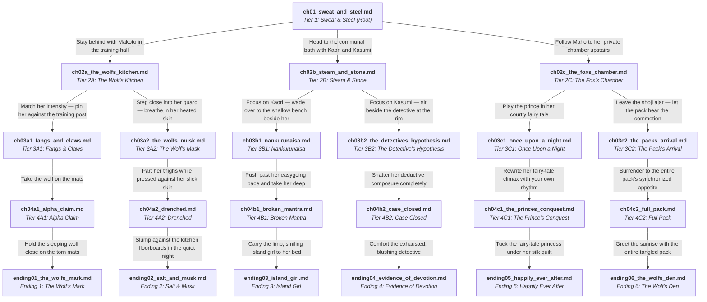

# Story Graph & Narrative Architecture: The Wolf's Den

## 1. High-Concept & Narrative Overview

- **Title**: The Wolf's Den (狼の巣)
- **Story ID**: `the_wolfs_den`
- **Setting**: Caon Guildhall — Post-Training Evening Cool-Down.
- **Protagonist**: Yuuki (Princess Knight) — First-Person POV ("I").
- **Cast**: Makoto (Wolf), Kaori (Dog), Kasumi (Doberman), Maho (Fox).
- **Catalyst**: Organic post-training exhaustion, shared proximity, and unshielded intimacy.
- **Graph Topology**: Pure directed out-tree (arborescence). In-degree = 1 for all non-root nodes. 100% path isolation. Zero convergence.

---

## 2. Interactive Story Graph (Full Mermaid Flowchart)

---

## 3. Chapter Ledger & Specifications

| Chapter File | Tier / Role | Minimum Words | NSFW Level | Key Beats & Off-Route Accounting |
|:---|:---:|:---:|:---:|:---|
| `ch01_sweat_and_steel.md` | Tier 1 (Root) | 1,500 | SFW | All 4 members sparring, cooling down, barley tea. 3-way branching choice. |
| `ch02a_the_wolfs_kitchen.md` | Tier 2A (Branch) | 1,500 | SFW $\to$ Tension | Makoto route. Kaori/Kasumi go to bath, Maho goes upstairs. Heavy sparring tension. |
| `ch02b_steam_and_stone.md` | Tier 2B (Branch) | 1,500 | SFW $\to$ Tension | Kaori/Kasumi route. Makoto stays in dojo, Maho upstairs. Bathhouse proximity. |
| `ch02c_the_foxs_chamber.md` | Tier 2C (Branch) | 1,500 | SFW $\to$ Tension | Maho route. Makoto/Kaori in dining hall, Kasumi in archives. Tea & fairy-tale room. |
| `ch03a1_fangs_and_claws.md` | Tier 3A1 (Foreplay) | 1,500 | Explicit Foreplay | Makoto rough: biting, pinning, oral, clawing, ears twitching. |
| `ch03a2_the_wolfs_musk.md` | Tier 3A2 (Foreplay) | 1,500 | Explicit Foreplay | Makoto musk: armpit licking, sweat worship, fingering, breast play. |
| `ch03b1_nankurunaisa.md` | Tier 3B1 (Foreplay) | 1,500 | Explicit Foreplay | Kaori bath: cheerful blowjob, wet clit massage, playful dirty talk. |
| `ch03b2_the_detectives_hypothesis.md` | Tier 3B2 (Foreplay) | 1,500 | Explicit Foreplay | Kasumi bath: clinical oral, steamed glasses, deductive composure cracking. |
| `ch03c1_once_upon_a_night.md` | Tier 3C1 (Foreplay) | 1,500 | Explicit Foreplay | Maho solo: fairy-tale narration, fox tail wrapping, refined dialect moans. |
| `ch03c2_the_packs_arrival.md` | Tier 3C2 (Foreplay) | 1,500 | Explicit Foreplay | Group assembly: Makoto, Kaori, Kasumi barge in; competitive strip & claims. |
| `ch04a1_alpha_claim.md` | Tier 4A1 (Climax) | 2,200 | Explicit Climax | Makoto rough: dominant riding, doggy, hair pulling, deep creampie. |
| `ch04a2_drenched.md` | Tier 4A2 (Climax) | 2,200 | Explicit Climax | Makoto sweat: armpit sex, drenched missionary, slippery creampie. |
| `ch04b1_broken_mantra.md` | Tier 4B1 (Climax) | 2,200 | Explicit Climax | Kaori mind-break: ahegao, drool, broken "nankurunaisa", endless orgasms. |
| `ch04b2_case_closed.md` | Tier 4B2 (Climax) | 2,200 | Explicit Climax | Kasumi shattered: petite stretching, loud screams, detective unraveled. |
| `ch04c1_the_princes_conquest.md` | Tier 4C1 (Climax) | 2,200 | Explicit Climax | Maho ravished: tail coiling, Kyoto dialect shattered, fantasy climax. |
| `ch04c2_full_pack.md` | Tier 4C2 (Climax) | 2,200 | Explicit Climax | 5-way pack orgy: all 4 girls taken, multiple rounds, synchronized release. |
| `ending01_the_wolfs_mark.md` | Tier 5 (Ending 1) | 2,200 | Climax & Afterglow | Makoto aftermath: tavern breakfast, bite marks, pack teasing. |
| `ending02_salt_and_musk.md` | Tier 5 (Ending 2) | 2,200 | Climax & Afterglow | Makoto aftermath: warm bath cooldown, lingering scent, morning banter. |
| `ending03_island_girl.md` | Tier 5 (Ending 3) | 2,200 | Climax & Afterglow | Kaori aftermath: carrying her to futon, wobbly morning legs, sunny grins. |
| `ending04_evidence_of_devotion.md` | Tier 5 (Ending 4) | 2,200 | Climax & Afterglow | Kasumi aftermath: shaky case notes, morning analytical blushes. |
| `ending05_happily_ever_after.md` | Tier 5 (Ending 5) | 2,200 | Climax & Afterglow | Maho aftermath: morning tea, serene fox smile, tail clinging. |
| `ending06_the_wolfs_den.md` | Tier 5 (Ending 6) | 2,200 | Climax & Afterglow | Pack aftermath: tangled morning pile, shared clean-up, guild solidarity. |
